<style>
p.caption {
  font-size: 0.8em;
  text-align: center;
  font-weight: normal;
}
    caption {
      color: grey;
      font-size: 0.8em;
    }
@font-face{
  font-family: Helvetica; 
  src:url('Helvetica.ttf');
}
body{
  font-size: 11pt;
  font-family: Helvetica;
}
h1,h2,h3,h4,h5,h6{
  font-family: Helvetica;
}
td{
  font-size: 9pt;
  font-family: Helvetica;
}
th{
  font-size: 0.8em;
  font-family: Helvetica;
  color: black;
}
</style>
---

```{r setup, include=FALSE}
knitr::opts_chunk$set(echo = TRUE)
```

```{r set_up,message = FALSE, warning = FALSE, results='hide'}
crs = 'EPSG:26913'

library(stringr)
library(tidyverse)
library(sf)
library(lubridate)
library(tigris)
library(gganimate)
library(riem)
library(gridExtra)
library(knitr)
library(kableExtra)
library(FNN)
library(spdep)
library(caret)
library(ckanr)
library(grid)
library(gridExtra)
library(knitr)
library(kableExtra)
library(tidycensus)
library(scales)
library(stargazer)
library(sjPlot)
library(sjmisc)
library(sjlabelled)
library(mapview)
library(ggmap)
library(jsonlite)
library(magick)
library(magrittr)
library(janitor)

root.dir = "https://raw.githubusercontent.com/urbanSpatial/Public-Policy-Analytics-Landing/master/DATA/"
source("https://raw.githubusercontent.com/urbanSpatial/Public-Policy-Analytics-Landing/master/functions.r")

windowsFonts(font = windowsFont('Helvetica'))

ll <- function(dat, proj4 = 4326){st_transform(dat, proj4)}

plotTheme <- function(base_size = 9, title_size = 10){
  theme(
    text = element_text(family = 'font', color = "black"),
    plot.title = element_text(family = 'font',
                              size = title_size, colour = "black", hjust = 0.5), 
    plot.subtitle = element_text(family = 'font', face = 'italic',
                                 size = base_size, colour = "black", hjust = 0.5),
    plot.caption = element_text(family = 'font', hjust=0),
    axis.ticks = element_blank(),
    panel.background = element_blank(),
    panel.grid.major = element_line("grey80", size = 0.01),
    panel.grid.minor = element_blank(),
    panel.border = element_rect(colour = "black", fill=NA, size=.5),
    strip.background = element_blank(),
    strip.text = element_text(family = 'font', size=9),
    axis.title = element_text(family = 'font', size=9),
    axis.text = element_text(family = 'font', size=7),
    axis.text.y = element_text(family = 'font', size=7),
    plot.background = element_blank(),
    legend.background = element_blank(),
    legend.title = element_text(family = 'font', colour = "black", face = "italic", size = 9),
    legend.text = element_text(family = 'font', colour = "black", face = "italic", size = 7),
    strip.text.x = element_text(family = 'font', size = 9),
    legend.key.size = unit(.5, 'line')
  )
}

mapTheme <- function(base_size = 9, title_size = 10){
  theme(
    text = element_text(family = 'font', color = "black"),
    plot.title = element_text(family = 'font',
                              size = title_size, colour = "black", hjust = 0.5), 
    plot.subtitle = element_text(family = 'font', face = 'italic',
                                 size = base_size, colour = "black", hjust = 0.5),
    plot.caption = element_text(family = 'font', hjust=0),
    axis.ticks = element_blank(),
    panel.background = element_blank(),
    panel.grid.major = element_blank(),
    panel.grid.minor = element_blank(),
    panel.border = element_blank(),
    strip.background = element_blank(),
    strip.text = element_text(size=base_size),
    axis.title = element_text(family = 'font', size=9),
    axis.text = element_blank(),
    axis.text.y = element_blank(),
    plot.background = element_blank(),
    legend.background = element_blank(),
    legend.title = element_text(family = 'font', colour = "black", face = "italic", size = 9),
    legend.text = element_text(family = 'font', colour = "black", face = "italic", size = 7),
    strip.text.x = element_text(size=base_size),
    legend.key.size = unit(.5, 'line')
  )
}

brightRed = '#f2727f'
darkBlue = '#315d7f'
palette5 <- c("#f9b294","#f2727f","#c06c86","#6d5c7e","#315d7f")
palette4 <- c("#f9b294","#f2727f","#c06c86","#6d5c7e")
palette2 <- c("#f9b294","#f2727f")
palette1_main <- "#F2727F"
palette1_assist <- '#F9B294'
```

### 1. Use case: What's it for?

**This project aims to predict train delays 2 hours ahead of schedule for New Jersey Transit.** Railway transit an integral part of metropolitan mobility. Covering a service area of 5,325 square miles, New Jersey Transit is the largest statewide public transit system and the third-largest provider of bus, rail, and light rail transit in the United States.
^[New Jersey Transit website: https://www.njtransit.com/our-agency/about-us]
Figure 1. shows the location of each New Jersey Transit station. The network consists of radial lines centered around Jersey City, Newark, and New York, with the exception of the Atlantic City Line which runs between Atlantic City and Philadelphia and is detached from the main network.

```{r geographies&stations, message = FALSE, warning = FALSE, results='hide'}
# County Geographical data
njCounties =
  tigris::counties(state = "34")%>%
  st_transform(crs)%>%
  dplyr::select(GEOID,NAMELSAD,geometry)

# NJ Transit station data
njStations = st_read('https://opendata.arcgis.com/datasets/4809dada94c542e0beff00600ee930f6_0.geojson') %>%
  st_transform(crs) %>%
  dplyr::select(station = STATION_ID, geometry) %>%
  # Trying to standardize the station names...
  mutate(station = tolower(station)) %>%
  mutate(station = 
           case_when(
             # str_detect(station, '-') ~
             #   substr(station, 1, str_locate(station, '-')[[1]] - 1),
             substr(station, nchar(station) - 15, nchar(station)) == ' railway station'~
               substr(station, 1, nchar(station) - 16),
             substr(station, nchar(station) - 12, nchar(station)) == ' rail station'~
               substr(station, 1, nchar(station) - 13),
             substr(station, nchar(station) - 7, nchar(station)) == ' station' ~
               substr(station, 1, nchar(station) - 8),
             substr(station, nchar(station) - 8, nchar(station)) == ' terminal' ~
               substr(station, 1, nchar(station) - 9),
             TRUE ~ station
           )) %>%
  mutate(joined = 1)

# Further modifying station names
njStations[12, 1] = 'middletown nj'
njStations[149, 1] = 'middletown ny'
njStations[131, 1] = 'anderson street'
njStations[99, 1] = 'atlantic city rail'
njStations[87, 1] = 'bay street'
njStations[134, 1] = 'wood ridge'
njStations[90, 1] = 'watsessing avenue'
njStations[133, 1] = 'teterboro'
njStations[159, 1] = 'secaucus upper lvl'
njStations[166, 1] = 'secaucus lower lvl'
njStations[102, 1] = 'ramsey main st'
njStations[156, 1] = 'ramsey route 17'
njStations[102, 1] = 'ramsey main st'
njStations[115, 1] = 'radburn fair lawn'
njStations[140, 1] = 'princeton junction'
njStations[92, 1] = 'philadelphia'
njStations[165, 1] = 'pennsauken'
njStations[80, 1] = 'mountain view'
njStations[163, 1] = 'mount arlington'
njStations[158, 1] = 'montclair state u'
njStations[107, 1] = 'glen rock main line'
njStations[114, 1] = 'glen rock boro hall'
njStations[116, 1] = 'broadway fair lawn'
njStations[132, 1] = 'essex street'

# Line
lines = rbind(
  st_read('https://services6.arcgis.com/M0t0HPE53pFK525U/arcgis/rest/services/NJTransit_Rail_Linea/FeatureServer/0/query?outFields=*&where=1%3D1&f=geojson') %>%
    st_transform(crs) %>%
    mutate(line = 'Northeast Corrdr') %>%
    dplyr::select(line),
  st_read('https://services6.arcgis.com/M0t0HPE53pFK525U/arcgis/rest/services/NJTransit_Rail_Linea/FeatureServer/6/query?outFields=*&where=1%3D1&f=geojson') %>%
    st_transform(crs) %>%
    mutate(line = 'Atl. City Line') %>%
    dplyr::select(line),
  st_read('https://services6.arcgis.com/M0t0HPE53pFK525U/arcgis/rest/services/NJTransit_Rail_Linea/FeatureServer/7/query?outFields=*&where=1%3D1&f=geojson') %>%
    st_transform(crs) %>%
    mutate(line = 'Bergen Co. Line ') %>%
    dplyr::select(line),
  st_read('https://services6.arcgis.com/M0t0HPE53pFK525U/arcgis/rest/services/NJTransit_Rail_Linea/FeatureServer/9/query?outFields=*&where=1%3D1&f=geojson') %>%
    st_transform(crs) %>%
    mutate(line = 'Gladstone Branch') %>%
    dplyr::select(line),
  st_read('https://services6.arcgis.com/M0t0HPE53pFK525U/arcgis/rest/services/NJTransit_Rail_Linea/FeatureServer/4/query?outFields=*&where=1%3D1&f=geojson') %>%
    st_transform(crs) %>%
    mutate(line = 'Main Line') %>%
    dplyr::select(line),
  st_read('https://services6.arcgis.com/M0t0HPE53pFK525U/arcgis/rest/services/NJTransit_Rail_Linea/FeatureServer/8/query?outFields=*&where=1%3D1&f=geojson') %>%
    st_transform(crs) %>%
    mutate(line = 'Montclair-Boonton') %>%
    dplyr::select(line),
  st_read('https://services6.arcgis.com/M0t0HPE53pFK525U/arcgis/rest/services/NJTransit_Rail_Linea/FeatureServer/3/query?outFields=*&where=1%3D1&f=geojson') %>%
    st_transform(crs) %>%
    mutate(line = 'Morristown Line') %>%
    dplyr::select(line),
  st_read('https://services6.arcgis.com/M0t0HPE53pFK525U/arcgis/rest/services/NJTransit_Rail_Linea/FeatureServer/10/query?outFields=*&where=1%3D1&f=geojson') %>%
    st_transform(crs) %>%
    mutate(line = 'No Jersey Coast') %>%
    dplyr::select(line),
  st_read('https://services6.arcgis.com/M0t0HPE53pFK525U/arcgis/rest/services/NJTransit_Rail_Linea/FeatureServer/12/query?outFields=*&where=1%3D1&f=geojson') %>%
    st_transform(crs) %>%
    mutate(line = 'Pascack Valley') %>%
    dplyr::select(line),
  st_read('https://services6.arcgis.com/M0t0HPE53pFK525U/arcgis/rest/services/NJTransit_Rail_Linea/FeatureServer/11/query?outFields=*&where=1%3D1&f=geojson') %>%
    st_transform(crs) %>%
    mutate(line = 'Raritan Valley') %>%
    dplyr::select(line)
)
```

```{r stations_exploratory_plot2,fig.height = 5,message = FALSE, warning = FALSE, results='hide',out.width = '75%',fig.align = 'center',fig.cap = 'Figure 1. Locations of New Jersey Transit stations'}
base_map <- get_map(location = unname(st_bbox(ll(st_buffer(st_union(njCounties),11000)))),maptype = "terrian")

ggmap(base_map) + 
  geom_sf(data=ll(st_union(njCounties)),color="black",size=1.2,fill = "transparent",inherit.aes = FALSE)+
  geom_sf(data=ll(njCounties),color="black",size=0.5,linetype ="dashed",fill = "transparent",inherit.aes = FALSE)+
  geom_sf(data=ll(lines),size=1.5,color=palette1_main,inherit.aes = FALSE)+
  labs(title = "Map of NJ Transit Railway Stations", 
       subtitle = "Red dots are stations",
       x="",y="")+
  mapTheme()

```

But this system faces serious operation issues: according to Federal Transit Administration data, New Jersey Transit broke down more than more than any other system in the nation in 2019, plagued by constant delays and cancellations.
^[*NJ Transit trains are the nation’s worst again, feds say*, News by NJ.com: https://www.nj.com/traffic/2019/12/nj-transit-trains-are-the-nations-worst-again-feds-say.html]

<br>

```{r ReadbackgroundPic, echo=FALSE,fig.height = 2,out.width = '75%',fig.align = 'center',fig.cap='Figure 2. A NJ Transit train disabled by a fire at the Princeton Junction'}
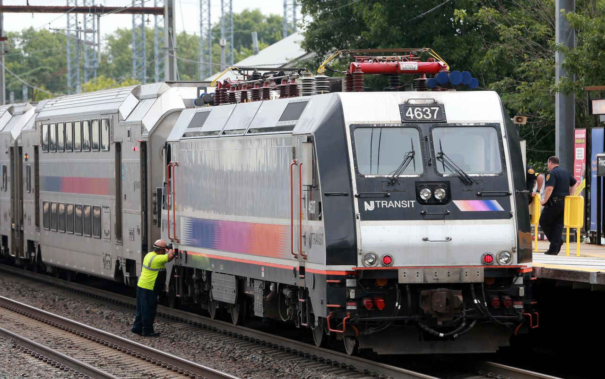
```
<br>
A main reason for train delays is high passenger flows that exceed station capacity in particular space-times. But the current train dispatch system cannot foresee train delays long ahead of schedule and therefore cannot take action accordingly. With our prediction algorithm, once the transit company predicts, 2 hours ahead of schedule, that a long delay will occur, they can take measures in real time to mitigate the situation, e.g., adjusting train speeds, or directing more staff to assist passenger movement in the station. Furthermore, our algorithm can reveal the primary factors leading to train delays, based on which to improve the entire transit network.

<br>
```{r ReadbackgroundPic2, echo=FALSE,fig.height = 1,out.width = '75%',fig.align = 'center', fig.cap = 'Figure 3. Use case of our predicting algorithm'}
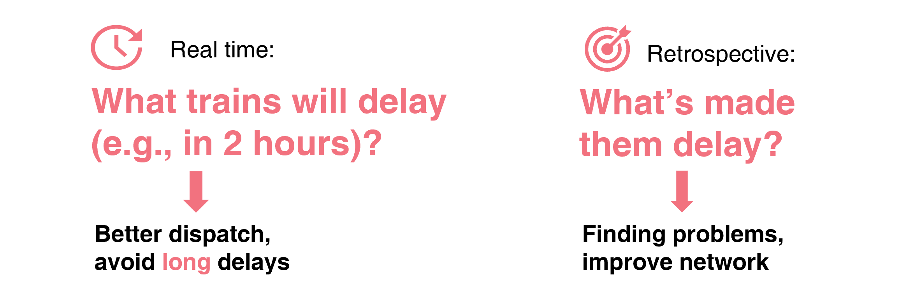
```
<br>

### 2. Exploring and wrangling data

This early-stage model employs a data-set that contains information of *every departure*, including line, station and departure, and scheduled and actual time of departure, from September to October in 2019.
^[Data-set on Kaggle: https://www.kaggle.com/pranavbadami/nj-transit-amtrak-nec-performance] 
In this section, we explore the date-set to find patterns and wrangle the data for model building.

```{r read_trains_data, message = FALSE, warning = FALSE, results='hide'}
# 2019.9
trainsSep = read.csv('2019_09.csv') %>%
  filter(., type == 'NJ Transit' & status == 'departed' &
           line != 'Princeton Shuttle') %>%
  mutate(date = ymd(date),
         scheduled_time = ymd_hms(scheduled_time),
         actual_time = ymd_hms(actual_time)) %>%
  dplyr::select(-status,-type)

# 2019.10
trainsOct = read.csv('2019_10.csv') %>%
  filter(., type == 'NJ Transit' & status == 'departed' &
           line != 'Princeton Shuttle') %>%
  mutate(date = ymd(date),
         scheduled_time = ymd_hms(scheduled_time),
         actual_time = ymd_hms(actual_time)) %>%
  arrange(stop_sequence) %>%
  dplyr::select(-status,-type)

# Bind the two-month data
trains = rbind(trainsSep, trainsOct) %>%
  # Trying to standardize station names
  mutate(to = tolower(to),
         from = tolower(from)) 

# Standardize names
trainsWithGeometry = trains %>%
  filter(., to != 'secaucus concourse') %>%
  mutate(to = 
           case_when(
             str_detect(to, '-') ~
               substr(to, 1, str_locate(to, '-')[[1]] - 1),
             substr(to, nchar(to) - 15, nchar(to)) == ' railway station'~
               substr(to, 1, nchar(to) - 16),
             substr(to, nchar(to) - 12, nchar(to)) == ' rail station'~
               substr(to, 1, nchar(to) - 13),
             substr(to, nchar(to) - 7, nchar(to)) == ' station' ~
               substr(to, 1, nchar(to) - 8),
             substr(to, nchar(to) - 8, nchar(to)) == ' terminal' ~
               substr(to, 1, nchar(to) - 9),
             TRUE ~ to
           ),
         from = 
           case_when(
             str_detect(from, '-') ~
               substr(from, 1, str_locate(from, '-')[[1]] - 1),
             substr(from, nchar(from) - 15, nchar(from)) == ' railway station'~
               substr(from, 1, nchar(from) - 16),
             substr(from, nchar(from) - 12, nchar(from)) == ' rail station'~
               substr(from, 1, nchar(from) - 13),
             substr(from, nchar(from) - 7, nchar(from)) == ' station' ~
               substr(from, 1, nchar(from) - 8),
             substr(from, nchar(from) - 8, nchar(from)) == ' terminal' ~
               substr(from, 1, nchar(from) - 9),TRUE ~ from
           )) %>%
  left_join(njStations, by = c('to' = 'station')) %>%
  st_sf() %>%
  dplyr::select(-joined)
```

#### 2.1 Train IDs

We first explore the nature of Train IDs (`train_id`) in the data-set by demonstrating the following tables. Table 1. shows that train IDs remain constant as the train completes the journey from the first station to the last on a particular line. Next, as Table 2. demonstrates, different trains that run on the same line use different train IDs at different times of the day, and that trains with different IDs may have different starting and terminal stations despite being on the same line. Finally, Table 3 shows that trains on different dates share the same ID if they run on the same line at a specific time of day.

```{r illustrate trainID and express line,message = FALSE, warning = FALSE, results='hide'}
# A trainID is for a whole trip
trainIDforWholeTrip = trains%>%
  filter(train_id == 7824, date == "2019-10-06")%>%
  arrange(date, train_id)%>%
  dplyr::select(train_id,stop_sequence,from,to,line)
trainIDforWholeTrip = trainIDforWholeTrip[1:5,]
# Different TrainIDs is within the same day & Express or normal lines
difTrainIDs = trains%>%
  filter(line=="Northeast Corrdr",date=="2019-10-06",stop_sequence=="2")%>%
  arrange(date,train_id)%>%
  dplyr::select(scheduled_time,train_id,from,to,line)
difTrainIDs = difTrainIDs[1:5,]

# A TrainID is allocated for the specific time slot train everyday or more
TrainIDforDifDay = trains%>%
  filter(line=="Northeast Corrdr",train_id==7824,stop_sequence=="2")%>%
  arrange(date,to)%>%
  dplyr::select(scheduled_time,train_id,from,to,line)
TrainIDforDifDay = TrainIDforDifDay[1:5,]
```

```{r table1 for illustrate trainID and express line, echo=FALSE,fig.height=1, results='asis'}
kable(trainIDforWholeTrip,align = 'c',caption = '<center>Table 1. trainID for a whole trip</center>',table.attr = "style='width:75%;'")%>%
  kable_classic(full_width = T)%>%
  kable_styling(position = "center")%>%
  column_spec(2, bold = T,color = palette1_assist)%>%
  column_spec(3, bold = T,color = palette1_main)
```

```{r table2 for illustrate trainID and express line, echo=FALSE,fig.height=1, results='asis'}
kable(difTrainIDs,align = 'c',caption = '<center>Table 2. Different TrainIDs within the same day & Express or normal lines</center>',table.attr = "style='width:75%;'")%>%
  kable_classic(full_width = T)%>%
  kable_styling(position = "center")%>%
  column_spec(2, bold = T,color = palette1_assist)%>%
  row_spec(2, bold = T,color = palette1_main)%>%
  row_spec(3, bold = T,color = palette1_main)
```

```{r table3 for illustrate trainID and express line, echo=FALSE,fig.height=1, results='asis'}
kable(TrainIDforDifDay,align = 'c',caption = '<center>Table 3. TrainID is allocated for the specific time slot everyday</center>',table.attr = "style='width:75%;'")%>%
  kable_classic(full_width = T)%>%
  kable_styling(position = "center")%>%
  column_spec(2, bold = T,color = palette1_main)%>%
  column_spec(1,bold = T,color = palette1_assist)
```

#### 2.2 Delays by line and station

Average time of delay varies across different lines and stations. Figure 4. shows the average delay of each line, and Figure 5. plots the average delay of each station on each line. These plots suggest that the line and station are important factors for the prediction of delays. The Atlantic City Line, apart from being physically detached, is also an outlier with the average delay length about four times that of the other lines.

```{r Average delay time,message = FALSE, warning = FALSE, results='hide'}
# Average delay time for different train lines
plot1 <- trainsWithGeometry%>%
  st_drop_geometry()%>%
  dplyr::select(delay_minutes,line)%>%
  na.omit()%>%
  group_by(line)%>%
  summarise(averageDelay=mean(delay_minutes))%>%
  ggplot(aes(line,averageDelay))+
  geom_bar(fill=palette1_main,position ="dodge", stat ="summary", fun ="mean")+
  labs(title = "",x="Lines",y="Average Delay")+
  plotTheme(5,10)+
  theme(legend.position = "none",
        axis.text.x = element_text(angle = 90, hjust = 1),
        panel.spacing = unit(2, 'lines'),
        panel.border = element_rect(colour = "black", fill=NA, size=.5))

plot2 <- trainsWithGeometry%>%
  dplyr::select(to,delay_minutes,line)%>%
  na.omit()%>%
  group_by(line)%>%
  summarise(averageDelay=mean(delay_minutes))%>%
  st_drop_geometry()

byLine2 = lines %>%
  left_join(plot2, by = 'line')%>%
  ggplot()+
  geom_sf(data=st_union(njCounties),color="black",size=1,fill = "transparent")+
  geom_sf(data=njCounties,color="black",size=0.5,linetype ="dashed",fill = "transparent")+
  geom_sf(aes(color=averageDelay),alpha=0.7,size=.75)+
  scale_color_gradient(high = brightRed, low = darkBlue, name = '') +
  labs(title = "",x="Stations",y="")+
  mapTheme(5,10)+
  theme(legend.position = "none")

grid.arrange(plot1, byLine2,ncol=2,top = paste("All Lines"," Spatial Delay Distribution",sep = ""))
```


```{r Average delay time2,message = FALSE, warning = FALSE, results='hide',eval=FALSE}
# Average delay time for different train stations within the same line
linelist <- unique(trainsWithGeometry$line)

for (i in linelist){
plot1 <- trainsWithGeometry%>%
  st_drop_geometry()%>%
  dplyr::select(to,delay_minutes,line)%>%
  na.omit()%>%
  group_by(to,line)%>%
  summarise(averageDelay=mean(delay_minutes))%>%
  filter(line == i)%>%
  ggplot(aes(to,averageDelay))+
  geom_bar(fill=palette1_main,position ="dodge", stat ="summary", fun ="mean")+
  labs(title = "",x="Stations",y="Average Delay")+
  plotTheme(5,10)+
  theme(legend.position = "none",
        axis.text.x = element_text(angle = 90, hjust = 1),
        panel.spacing = unit(2, 'lines'),
        panel.border = element_rect(colour = "black", fill=NA, size=.5))

plot2 <- trainsWithGeometry%>%
  dplyr::select(to,delay_minutes,line)%>%
  na.omit()%>%
  group_by(to,line)%>%
  summarise(averageDelay=mean(delay_minutes))%>%
  filter(line == i)%>%
  ggplot()+
  geom_sf(data=st_union(njCounties),color="black",size=1,fill = "transparent")+
  geom_sf(data=njCounties,color="black",size=0.5,linetype ="dashed",fill = "transparent")+
  geom_sf(data=njStations,size=1,color=palette1_assist,alpha=0.5)+
  geom_sf(aes(size=averageDelay),color=palette1_main,alpha=0.7)+
  scale_size_continuous(range = c(1, 3))+
  labs(title = "",x="Stations",y="")+
  mapTheme(5,10)+
  theme(legend.position = "none")

g <- arrangeGrob(plot1, plot2,ncol=2,top = paste(i," Spatial Delay Distribution",sep = ""))
ggsave(path="../geo",paste(i,"geo.png",sep = ""),g)}

# list.files(path="./geo",pattern = '*.png', full.names = TRUE) %>% 
#         image_read() %>% 
#         image_join() %>% 
#         image_animate(fps=1) %>% 
#         image_write("./geo/allLines.gif")
```

```{r ReadGif for alllines, echo=FALSE,fig.height = 3,out.width = '75%',fig.align = 'center'}
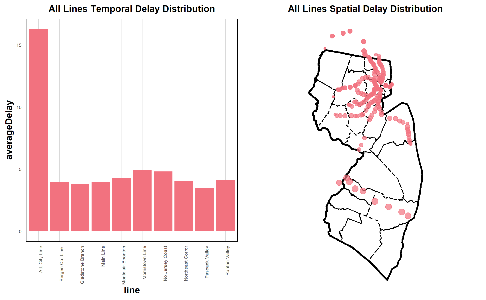
```

#### 2.3 Serial autocorrelation and time lag features

Figure 6. plots average train delays of each line by the progression of time. Delays exhibit highly regular hourly and daily patterns, suggesting that *time* and *time lag features* are important factors to be incorporated in the model.

```{r lineChart in the scale of time, message = FALSE, warning = FALSE, results='hide',eval=FALSE,fig.width=9,fig.height=4}
monday <-trainsWithGeometry%>%
  st_drop_geometry()%>%
  filter(line=="No Jersey Coast")%>%
  na.omit()%>%
  mutate(interval_hour = ymd_h(substr(scheduled_time, 1, 13)),
         dayotw = wday(scheduled_time),
         week = week(scheduled_time),
         hour = hour(scheduled_time))%>%
  arrange(dayotw,interval_hour)%>%
  filter(week%in%(36:43))%>%
  mutate(monday = ifelse(dayotw == 1 & hour == 0,interval_hour, 0)) %>%
  filter(monday != 0)

linelist <- unique(trainsWithGeometry$line)

for (i in linelist){
  
plot1 <- trainsWithGeometry%>%
  st_drop_geometry()%>%
  filter(line==i)%>%
  na.omit()%>%
  mutate(interval_hour = ymd_h(substr(scheduled_time, 1, 13)),
         week = week(scheduled_time))%>%
  filter(week%in%(36:43))%>%
  group_by(interval_hour,line,date)%>%
  summarise(AverageDelayInHour = mean(delay_minutes))%>%
  ggplot(aes(interval_hour,AverageDelayInHour)) + 
  geom_line(color=palette1_main,size=1)+
  geom_vline(data = monday, aes(xintercept = interval_hour),linetype = "dashed",size=1)+
  labs(title = paste("Line:",i,sep = ""),x='',y="Average Delay by Hour")+
  plotTheme(10,20)+
  theme(panel.border = element_rect(colour = "black", fill=NA, size=3))

stationlist <- trainsWithGeometry%>%filter(line==i)
stationlist <- unique(stationlist$to)
for (j in stationlist){
plot2 <- trainsWithGeometry%>%
  st_drop_geometry()%>%
  filter(line==i & to==j)%>%
  na.omit()%>%
  mutate(interval_hour = ymd_h(substr(scheduled_time, 1, 13)),
         week = week(scheduled_time))%>%
  filter(week%in%(36:43))%>%
  group_by(interval_hour,date)%>%
  summarise(AverageDelayInHour = mean(delay_minutes))%>%
  ggplot(aes(interval_hour,AverageDelayInHour)) + 
  geom_line(color=palette1_main,size=1)+
  geom_vline(data = monday, aes(xintercept = interval_hour),linetype = "dashed",size=1)+
  labs(title = paste("Station:",j,sep = ""),x="Interval Hour",y="Average Delay by Hour")+
  plotTheme(10,20)+
  theme(panel.border = element_rect(colour = "black", fill=NA, size=3))

g <- arrangeGrob(plot1, plot2,ncol=1)
ggsave(path="../temporal",paste(i,j,"_temporal.png",sep = "_"),g)}}

# list.files(path="../temporal/select",pattern = '*.png', full.names = TRUE) %>%
#         image_read() %>% # reads each path file
#         image_join() %>% # joins image
#         image_animate(fps=1) %>% # animates, can opt for number of loops
#         image_write("../temporal/select") # write to current dir
```

```{r ReadGif for alltemporal, echo=FALSE,fig.height = 6,out.width = '75%',fig.align = 'center'}
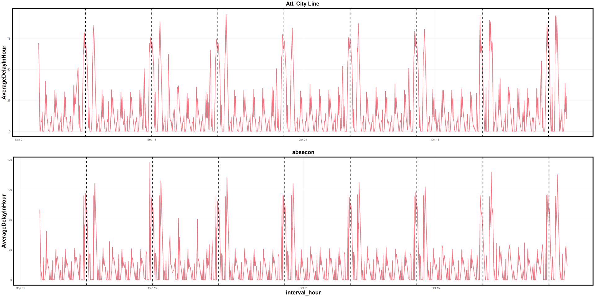
```

The *time lag features* are essentially the previous delays prior to each scheduled departure. In this model, we use three types time lag features:

1. *Line delay*. We consider the line as a system in terms of delays where the delay of one train at one point of the line depends on the delay of other trains. Therefore, for every departure, we calculate the delay of every its corresponding *line* (`lagDelay`) at the time of prediction prior to schedule (in this case, 2 hours). 

2. *Station delay*. For every departure, we calculate the average delay of *the station of departure* of the hour up to the time of prediction prior to schedule (`stationDelay`). We do the same calculations for the previous station (`stationLag1Delay`) and the station previous to that (`stationLag2Delay`).

3. *Same-train previous delay*. For every delay, we also take in the delay of the same train (i.e. having identical train IDs) at the same station for the last time (`lagDelayDayPlus`): usually one day prior, but sometimes multiple days, depending on the frequency of each train.

The correlation of delays with these time lag features are presented in Figure 7.

```{r feature engineering, eval=FALSE, message=FALSE, warning=FALSE, results='hide'}

# Add a field: time of prediction

trains = trains %>%
  mutate(timeOfPrediction = scheduled_time - hours(2))

timeLagBase = 
  trains %>%
  dplyr::select(date, line, actual_time, delay_minutes)

findLagDelay = function(timeOfPrediction, line, date){
  narrowDown = 
    timeLagBase[timeLagBase$line == line &
                  timeLagBase$date == date &
                  difftime(timeOfPrediction,
                           timeLagBase$actual_time,
                           units = 'secs') > 0,] %>%
    arrange(desc(actual_time))
  return(narrowDown[1, 4])
}

# Line delay

for(i in 1:nrow(trains)){
  date = trains[i, 'date']
  line = trains[i, 'line']
  timeOfPrediction = trains[i, 'timeOfPrediction']
  lagDelay = findLagDelay(timeOfPrediction, line, date)
  trains[i, 'lagDelay'] = lagDelay
  if(i %% 1000 == 0){
    print(i)
  }
}

# Station delay

trains = trains %>% filter(., !is.na(stop_sequence))
stationAvgDelayBase = trains %>% 
  dplyr::select(station = to, actual_time, delay_minutes) %>%
  mutate(actual_time = ymd_hms(actual_time))

findAvgStationDelay = function(timeOfPrediction, depStation){
  narrowDown = 
    stationAvgDelayBase %>%
    filter(., station == depStation &
             actual_time %within% interval(timeOfPrediction - hours(1), timeOfPrediction))
  return(mean(narrowDown$delay_minutes, na.rm = T))
}

# Station delay: this station
for(i in 1:nrow(trains)){
  depStation = trains[i, 'to']
  timeOfPrediction = trains[i, 'timeOfPrediction']
  stationDelay = findAvgStationDelay(timeOfPrediction, depStation)
  trains[i, 'stationDelay'] = stationDelay
  if(i %% 1000 == 0){
    print(i)
  }
}

# Station delay: the previous station
for(i in 1:nrow(trains)){
  depStation = trains[i, 'from']
  timeOfPrediction = trains[i, 'timeOfPrediction']
  lag1StationDelay = findAvgStationDelay(timeOfPrediction, depStation)
  trains[i, 'lag1StationDelay'] = lag1StationDelay
  if(i %% 1000 == 0){
    print(i)
  }
}

# Station delay: the station previous to the previous station
lastStation = 
  trains %>%
  dplyr::select(date, train = train_id, sequence = stop_sequence, lag2Station = from) %>%
  mutate(sequencePlus = sequence + 1) %>%
  dplyr::select(-sequence)

trains =
  left_join(trains, lastStation, by = c('date' = 'date',
                                'train_id' = 'train',
                                'stop_sequence' = 'sequencePlus')) %>%
  mutate(lag2Station = ifelse(is.na(lag2Station), from, lag2Station))

for(i in 1:nrow(trains)){
  depStation = trains[i, 'lag2Station']
  timeOfPrediction = trains[i, 'timeOfPrediction']
  lag2StationDelay = findAvgStationDelay(timeOfPrediction, depStation)
  trains[i, 'lag2StationDelay'] = lag2StationDelay
  if(i %% 1000 == 0){
    print(i)
  }
}

### Same-train previous delay
trains = 
  trains %>%
  group_by(train_id, to) %>%
  arrange(scheduled_time) %>%
  mutate(lagDelayDayPlus = lag(delay_minutes, 1)) %>%
  ungroup() %>%
  mutate(actualTime = ymd_hms(actual_time),
         scheduledTime = ymd_hms(scheduled_time),
         date = ymd(date)) %>%
  rename(delay = delay_minutes, train = train_id)

write.csv(trains, 'trains.csv')
```

```{r readCSV, warning=FALSE, include=FALSE, message=FALSE, results='hide'}
trains = read.csv('trains.csv') %>% dplyr::select(-X) %>%
  mutate(timeOfPrediction = ymd_hms(timeOfPrediction),
         date = ymd(date),
         scheduled_time = ymd_hms(scheduled_time),
         actual_time = ymd_hms(actual_time))
```

```{r correlationplot, message=FALSE, warning=FALSE,fig.width=10,fig.height=7,out.width='75%',fig.align = 'center', fig.cap = 'Figure 7. Delays as a function of time lag features'}
lagVarScatter <- trains%>%
  dplyr::select(delay,lagDelay,stationDelay,lag1StationDelay,lag2StationDelay,lagDelayDayPlus)%>%
  gather(Variable, Value, -delay) %>%
  mutate(Variable = fct_relevel(Variable,"Realtime Lag Delay","Average Station Delay","LagOneStationDelay","LagTwoStationDelay","LagDelayDayPlus"))

correlation.lag <-
  group_by(lagVarScatter, Variable) %>%
  summarize(correlation = round(cor(Value, delay,
                                    use = "complete.obs"), 2))

ggplot(lagVarScatter%>% sample_n(30000), aes(Value, delay)) +
  geom_point(size = .1, color = palette1_main) +
  geom_text(data = correlation.lag,aes(label = paste("r =", round(correlation, 2))),x=-Inf, y=Inf, vjust = 2, hjust = -.5,size=4) +
  geom_smooth(method = "lm", se = FALSE, colour = palette1_assist,size=1) +
  facet_wrap(~Variable, ncol = 3, scales = "free") +
  labs(
    x="Lag Trip Count") +
  plotTheme()
```

#### 2.4 Other

Weather, especially precipitation, could also be a factor for train delays. We collect weather information corresponding to each departure from the nearest weather station. The correlations between delays and weather features are plotted as scatter plots in Figure 8.

```{r weather_data,warning=FALSE, message=FALSE, results='hide'}

# Find which network
network = riem_networks()

# Get weather data
weatherStations = riem_stations(network = 'NJ_ASOS') %>%
  st_as_sf(coords = c('lon', 'lat'), crs = 4326, agr = 'constant') %>%
  st_transform(crs)
weatherStations$weatherStationIndex = row.names(weatherStations) %>% as.numeric()

njStations$weatherStationIndex =
  get.knnx(
  st_coordinates(weatherStations), 
  st_coordinates(njStations), 1)$nn.index

# Determine which weather station for which transit station
njStations = njStations %>%
  left_join(st_drop_geometry(weatherStations) %>%
              dplyr::select(weatherStationID = id, weatherStationIndex), 
            by = 'weatherStationIndex')

# Add weatherStationID
trains = trains %>%
  filter(., to != 'secaucus concourse') %>%
  left_join(njStations, by = c('to' = 'station')) %>%
  st_sf() %>%
  dplyr::select(-joined, -weatherStationIndex)

# Get weather Data
weatherStationList = unique(trains$weatherStationID)
weather = data.frame()
for(i in weatherStationList){
  weatherSeg = riem_measures(station = i, 
                          date_start = '2019-09-01',
                          date_end = '2019-10-31') %>%
    mutate_if(is.character, list(~replace(as.character(.), is.na(.), "0"))) %>%
    replace(is.na(.), 0) %>%
    mutate(hour = ymd_h(substr(valid, 1, 13))) %>%
    mutate(week = week(hour),
           dayOfWeek = wday(hour, label = T)) %>%
    group_by(hour) %>%
    summarize(temp = max(tmpf),
              precip = sum(p01i),
              windSpeed = max(sknt)) %>%
    mutate(temp = ifelse(temp == 0, 42, temp)) %>%
    mutate(precip = ifelse(precip > 0, precip, 0)) %>%
    mutate(weatherStationID = i)
  weather = rbind(weather, weatherSeg)
}

# Join Data
trains$timeHour = floor_date(trains$scheduled_time, unit = 'hour')
trains = trains %>%
  left_join(weather,
            by = c('weatherStationID' = 'weatherStationID',
                   'timeHour' = 'hour'))%>%
  st_sf()
```

```{r Weather Variables plot, message=FALSE, warning=FALSE,fig.width=10,fig.height=3.5,out.width='75%',fig.align = 'center', fig.cap = 'Figure 8. Delays as a function of weather features'}
weatherVarScatter <- trains%>%
  st_drop_geometry()%>%
  dplyr::select(delay,temp,precip,windSpeed)%>%
  gather(Variable, Value, -delay) 

correlation.lag <-
  group_by(weatherVarScatter, Variable) %>%
  summarize(correlation = round(cor(Value, delay,
                                    use = "complete.obs"), 2))
ggplot(weatherVarScatter%>% sample_n(30000), aes(Value, delay)) +
  geom_point(size = .1, color = palette1_main) +
  geom_text(data = correlation.lag,aes(label = paste("r =", round(correlation, 2))),x=-Inf, y=Inf, vjust = 2, hjust = -.5,size=4) +
  geom_smooth(method = "lm", se = FALSE, colour = palette1_assist,size=1) +
  facet_wrap(~Variable, ncol = 3, scales = "free") +
  labs(
    x="",y="Delay",
    title = "Time Delay of Weather") +
  plotTheme()
```

Other added features include: time fixed effects (hour of day and day of week), distance to the starting station, and direction. *Direction* may be relevant, because delays may be contingent on whether a train is enter or leaving central city. To determine the direction of each departure, we calculate the distance from *this* station, and that from the previous station, to New York Penn Station; if the train is running nearer to New York Penn Station, then we identify it as "downtown"; otherwise it is "uptown". 

The correlations between delays and these features are shown as scatter plots in Figure 9.

```{r other features, warning=FALSE, message=FALSE,results='hide',eval=FALSE}
### Add time fixed effect
trains2 = trains %>%
  mutate(hour = hour(scheduled_time),
         dayOfWeek = wday(scheduled_time),
         week = week(scheduled_time))%>%
  filter(week %in% c(37:43))%>%
  mutate(legend = case_when(
    week %in% c(37:41) ~ "train",
    TRUE ~ "test"))
stations = trains2 %>%dplyr::select(station = to, geometry) %>%unique()
### Distance to the first staion of the train
trainIDAndfirstStations = trains2 %>%
  filter(., stop_sequence == 1) %>%
  dplyr::select(firstStation = to, train) %>%
  unique()

firstStations = trainIDAndfirstStations %>%
  dplyr::select(firstStation) %>%
  unique()

distanceMatrix = 
  expand.grid(firstStation = firstStations$firstStation,
              njStation = stations$station)

for(i in 1:nrow(distanceMatrix)){
  thisFirstStation = distanceMatrix[i, 1]
  thisStation = distanceMatrix[i, 2]
  distance = st_distance(
    firstStations %>% filter(., firstStation == thisFirstStation),
    stations %>% filter(., station == thisStation)
  ) %>% as.numeric()
  distanceMatrix[i, 'distance'] = distance
  if(i %% 100 == 0){
    print(i)
  }
}

trainIDAndStations = trains2 %>%
  dplyr::select(station = to, train) %>%
  unique() %>%
  left_join(trainIDAndfirstStations %>% st_drop_geometry,
            by = 'train') %>%
  left_join(distanceMatrix, by = c('firstStation' = 'firstStation',
                                   'station' = 'njStation'))

trains3 = trains2 %>%
  left_join(st_drop_geometry(trainIDAndStations) %>%
              dplyr::select(-firstStation),
            by = c('to' = 'station',
                   'train' = 'train')) %>%
  rename(distFirstStation = distance)

### Uptown and Downtown
NYPennStation = stations %>%
  filter(., station == 'new york penn')

stations = stations %>%
  mutate(distNYPenn = 
           st_distance(., NYPennStation) %>% as.numeric())

trains4 = trains3 %>%
  left_join(st_drop_geometry(stations) %>%
              rename(lastStationDistNYPenn = distNYPenn),
            by = c('from' = 'station')) %>%
  left_join(st_drop_geometry(stations) %>%
              rename(thisStationDistNYPenn = distNYPenn),
            by = c('to' = 'station')) %>%
  mutate(direction = 
           ifelse(lastStationDistNYPenn >= thisStationDistNYPenn,
                  'downtown', 'uptown'))

trains4 = trains4 %>%
  mutate(lagDelay = tidyr::replace_na(lagDelay, 0),
         stationDelay = tidyr::replace_na(stationDelay, 0),
         lag1StationDelay = tidyr::replace_na(lag1StationDelay, 0),
         lag2StationDelay = tidyr::replace_na(lag2StationDelay, 0),
         lagDelayDayPlus = tidyr::replace_na(lagDelayDayPlus, 0),
         dayOfWeek = as.character(dayOfWeek),
         hour = as.character(hour))

```

```{r readtrain6,include=FALSE, message=FALSE, warning=FALSE,results='hide'}

trainsFinal = st_read("trains6.GeoJson",crs=crs)
```

```{r other features plot, message=FALSE, warning=FALSE,fig.width=7,fig.height=3.5,out.width='60%',fig.align='center',fig.cap = 'Figure 9. Delays as functions of the other features'}
correlation.lag <-
  trainsFinal %>%
  dplyr::select(delay,distFirstStation)%>%
  summarize(correlation = round(cor(distFirstStation, delay,
                                    use = "complete.obs"), 2))

grid.arrange(ncol=2,
ggplot(trainsFinal%>% sample_n(30000), aes(distFirstStation, delay)) +
  geom_point(size = .1, color = palette1_main) +
  geom_text(data = correlation.lag,aes(label = paste("r =", round(correlation, 2))),x=-Inf, y=Inf, vjust = 2, hjust = -.5,size=4) +
  geom_smooth(method = "lm", se = FALSE, colour = palette1_assist,size=1) +
  labs(
    x="Distance",y="Delay",
    title = "",
    subtitle = "") +
  plotTheme(),
trainsFinal %>%
  na.omit()%>%
  dplyr::select(delay,direction) %>%
  ggplot(aes(direction,delay)) +
  geom_bar(position ="dodge", stat ="summary", fun ="mean",fill = palette1_main) +
  labs(x="Direction", y="Mean",
       title ="",
       subtitle = "") +
  plotTheme() + 
  theme(legend.position = "none"))
```

A final feature added is the station-hour peak effect. As train delays are more likely to occur in certain stations with high passenger flow and at certain peak hours, we could improve the model by "singling out" those stations and hours. We calculate the average lengths of delay by every station-hour combination, and assign them with their deciles. We join the deciles back to original data-set of departures. Note that when we calculate the deciles, we only employ the training set.

```{r model prep TEN tile, warning=FALSE, message=FALSE,results='hide'}
trainsTrain = trainsFinal %>%
  filter(., legend == 'train')

stationHourMean = trainsTrain %>%
  group_by(to, hour) %>%
  summarize(meanDelay = mean(delay, na.rm = T)) %>%
  mutate(stationHour10Tile = ntile(meanDelay, 10) %>% as.character()) %>%
  st_drop_geometry() %>%
  mutate(hour = as.character(hour))

trainsTrain = trainsTrain %>%
  left_join(stationHourMean %>% dplyr::select(-meanDelay),
            by = c('to' = 'to',
                   'hour' = 'hour'))

trainsTest = trainsFinal %>%
  filter(., legend == 'test') %>%
  left_join(stationHourMean %>% dplyr::select(-meanDelay),
            by = c('to' = 'to',
                   'hour' = 'hour'))
```


### 4 Building and improving the model

#### 4.1 Two versions of baseline model

First, we try an Ordinary Least Square baseline model that takes *delay length* as the dependent variable and four categories of predictors:

1. *Fixed effects (time)*, i.e., hour of day and day of week.
2. *Fixed effects (space)*, i.e., line and station.
3. *Operation factors*, i.e., weather, direction, and stop sequence.
4. *Time lag features*, i.e., line delay, station delay, and same-train previous delay.

*How good is this model?* Figure 10. shows by scatter plot the relationship between the *predicted* delays and the *actual delays*, and Figure 11. plots the the differences between the predicted and actual delays for groups of short, median or long delays. It is evident that this baseline model 

```{r models,warning=FALSE, message=FALSE,results='hide'}

# Baseline
reg2hBaseline = lm(delay ~ 
               stop_sequence + to + line + lagDelay + stationDelay +
               lag1StationDelay + lag2StationDelay + lagDelayDayPlus +
               hour + dayOfWeek + precip + stationHour10Tile + distFirstStation + direction,
             data = trainsTrain)

trainsTest = trainsTest %>%
  mutate(predict2hBaseline = predict(reg2hBaseline, newdata = trainsTest),
         absError2hBaseline = abs(delay - predict2hBaseline))

# log the dependent (not good)
trainsTrain = trainsTrain %>%mutate(logDelay = log(delay + 1))

reg2hLnLog = lm(logDelay ~ 
               stop_sequence + to + line + lagDelay + stationDelay +
               lag1StationDelay + lag2StationDelay + lagDelayDayPlus +
               hour + dayOfWeek + precip+ stationHour10Tile + distFirstStation + direction,
             data = trainsTrain)

trainsTest = trainsTest %>%
  mutate(logPredict2hLog = predict(reg2hLnLog, newdata = trainsTest),
         predict2hLog = exp(logPredict2hLog) - 1,
         absError2hLog = abs(delay - predict2hLog))

# sq the dependent (better)
trainsTrain = trainsTrain %>%mutate(sqDelay = sqrt(delay))

reg2hLnSq = lm(sqDelay ~ 
               stop_sequence + to + line + lagDelay + stationDelay +
               lag1StationDelay + lag2StationDelay + lagDelayDayPlus +
               hour + dayOfWeek + precip+ stationHour10Tile + distFirstStation + direction,
             data = trainsTrain)

trainsTest = trainsTest %>%
  mutate(sqPredict2hSq = predict(reg2hLnSq, newdata = trainsTest),
         predict2hSq = sqPredict2hSq ^ 2,
         absError2hSq = abs(delay - predict2hSq))

# sq the dependent, and some independents squared 
reg2hLnSqSSq =lm(sqDelay ~
                   stop_sequence + to + line + lagDelay + I(lagDelay ^ 2) + stationDelay +
                   I(stationDelay ^ 2) + lag1StationDelay +
                   lag2StationDelay + lagDelayDayPlus +hour + dayOfWeek + precip + stationHour10Tile +
                   direction + distFirstStation,
                 data = trainsTrain)

trainsTest = trainsTest %>%
  mutate(sqPredict2hSSqSq = predict(reg2hLnSqSSq, newdata = trainsTest),
         predict2hSqSSq = sqPredict2hSSqSq ^ 2,
         absError2hSqSSq = abs(delay - predict2hSqSSq))

ErrComparison <- trainsTest%>%
  st_drop_geometry()%>%
  dplyr::select(delay,starts_with("absError"))%>%
  summarise(Baseline=mean(absError2hBaseline,na.rm=T),
            LogTrans=mean(absError2hLog,na.rm=T),
            SqrtDep=mean(absError2hSq,na.rm=T),
            SqrtDepIndep=mean(absError2hSqSSq,na.rm=T))
```


```{r models comparison, message=FALSE, warning=FALSE,fig.width=7,fig.height=7,out.width='60%',fig.align = 'center'}
trainsTest%>%
  dplyr::select(delay,starts_with("absError"))%>%
  st_drop_geometry()%>%
  gather(Variable, Value, -delay)%>%
  filter(Variable != 'absError2hSeg')%>%
  mutate(Variable=recode(Variable,
                         "absError2hBaseline" = 'BaseLine',
                         "absError2hLog" = "Log DEP Var",
                         "absError2hSq" = 'Sqrt DEP Var',
                         "absError2hSqSSq" = 'Sqrt DEP & IND Var')%>%
           factor(., levels = c('BaseLine','Log DEP Var','Sqrt DEP Var','Sqrt DEP & IND Var')))%>%
  ggplot() +
  geom_point(aes(x = delay, y = Value),size=.1,color=palette1_main) +
  facet_wrap(~Variable,scales = "free",ncol=2)+
  labs(x="Delay",y="Error",title = "")+
  plotTheme()
```

```{r models table,fig.height=1, results='asis'}
ErrComparison = ErrComparison%>%rename('Log Transform'='LogTrans','Sqrt DEP Var'='SqrtDep','Sqrt DEP & IND Vars'='SqrtDepIndep')
kable(ErrComparison,align = 'c',caption = '<center>Table.A </center>',table.attr = "style='width:75%;'")%>%
  kable_classic(full_width = T)%>%
  kable_styling(position = "center")%>%
  row_spec(0, bold = T,color = palette1_main)
```

#### 4.2 Logit models attempt

```{r logit reason plot, message=FALSE, warning=FALSE,fig.height=4,out.width='50%',fig.align='center'}
ggplot(trainsTrain) +
  geom_histogram(aes(delay), bins = 50,fill=palette1_main)+
  labs(title = '',x='Delay',y='Count') +
  plotTheme()
```

Since the outcome distribution is heavily skewed. A logit transformation should work well here. 

```{r late-or-not logit reg, message=FALSE, warning=FALSE}
trainsTrain2 = trainsTrain %>%
  mutate(late = ifelse(delay > 5, 1, 0))
trainsTest2 = trainsTest %>%
  mutate(late = ifelse(delay > 5, 1, 0))
lateOrNot = glm(late ~ 
                  stop_sequence + to + line + lagDelay + stationDelay +
                  lag1StationDelay + lag2StationDelay + lagDelayDayPlus +
                  hour + dayOfWeek + precip + stationHour10Tile + distFirstStation + direction,
                data = trainsTrain2,
                family="binomial" (link="logit"))

lateProbs = data.frame(
  outcome = as.factor(trainsTest2$late),
  probs = predict(lateOrNot, trainsTest2, type = 'response'))
```

```{r logit results plot, message=FALSE, warning=FALSE,fig.height=4,out.width='50%',fig.align='center'}
ggplot(lateProbs, aes(x = probs, fill = as.factor(outcome))) +
  geom_density(color=FALSE) +
  facet_grid(outcome ~.) +
  scale_fill_manual(values = palette2,name = "Delay or Not") +
  xlim(0, 1) +
  plotTheme()+
  labs(title = '',x='Probability',y='Density')+
  theme(legend.position = "bottom")
```

But from the drawing, we can see the density diagram is heavily overlapped. That means the logistic regression may not be suitable here.
Therefore we still focuses on the baseline model. From the plots, we can find out that the prediction error mainly exist in the small delay intervals. So the following section will try to focus on the small delays.

#### 4.3 Model for Small Delays

```{r model for small delays, message=FALSE, warning=FALSE}

reg2hLnSqSMALLDELAYS = lm(sqDelay ~
                            stop_sequence + to + line + lagDelay + stationDelay +
                            lag1StationDelay + lag2StationDelay + lagDelayDayPlus +
                            hour + dayOfWeek + precip + stationHour10Tile + distFirstStation + direction,
                 data = trainsTrain %>% filter(., delay <= 30))

trainsTest = trainsTest %>%
  mutate(sqPredict2hSqSMALLDELAYS = predict(reg2hLnSqSMALLDELAYS, newdata = trainsTest),
         predict2hSqSMALLDELAYS = sqPredict2hSqSMALLDELAYS ^ 2)

trainsTest = trainsTest %>%
  mutate(predict2hSelectionModel = 
           ifelse(predict2hSq <= 20,
                  predict2hSqSMALLDELAYS,
                  predict2hSq),
         absError2hSeg = abs(delay - predict2hSelectionModel))
```

```{r plot model for small delays, message=FALSE, warning=FALSE,fig.height=4,out.width='50%',fig.align='center'}
correlationForSmall <- mean(trainsTest$absError2hSeg, na.rm = T)%>%as.data.frame()

ggplot(trainsTest) +
  geom_point(aes(x = delay, y = predict2hSelectionModel), size = 0.1,color = palette1_main) +
  geom_text(data = correlationForSmall,aes(label = paste("MAE =", round(., 2))),x=-Inf, y=Inf, vjust = 2, hjust = -.5,size=4) +
  geom_abline(slope = 1, intercept = 0, colour = palette1_assist,size=1)+
  labs(
    x="Actual Delay",y="Predicted Delay",
    title = "",
    subtitle = "") +
  plotTheme()

```

### 5 Generalizability

#### 5.1 Cross Validation

Following is the CV for the dataset.
```{r cross validation by day,message=FALSE, warning=FALSE,eval=FALSE}
trainsL = trainsFinal %>%
  filter(line!="Atl. City Line")%>%
  mutate(sqDelay = sqrt(delay)) %>%
  left_join(stationHourMean %>% dplyr::select(-meanDelay),
            by = c('to' = 'to',
                   'hour' = 'hour'))

dateList = unique(trainsL$date)
MAE2hList = list()
MAE30mList = list()
dayNoList = list()

for (dayNo in dateList){
  gc()
  
  dayNoList = append(dayNoList, dayNo)
  cat('This hold-out test day is', dayNo, '\n')
  daysTrainL = trainsL %>% filter(., date != dayNo) %>% as.data.frame()
  daysTestL = trainsL %>% filter(., date == dayNo) %>% as.data.frame()
  
  reg2h = lm(sqDelay ~ 
               stop_sequence + to + line + lagDelay + stationDelay +
               lag1StationDelay + lag2StationDelay + lagDelayDayPlus +
               hour + dayOfWeek + precip + stationHour10Tile + direction,
             data = daysTrainL)
  reg2hSmall = lm(sqDelay ~ 
               stop_sequence + to + line + lagDelay + stationDelay +
               lag1StationDelay + lag2StationDelay + lagDelayDayPlus +
               hour + dayOfWeek + precip + stationHour10Tile + direction,
             data = daysTrainL %>% filter(., delay <= 30))
  testCompareL = data.frame(observation = daysTestL$delay,
                            sqPrediction = predict(reg2h, newdata = daysTestL),
                            sqPredictionSmall =predict(reg2hSmall, newdata = daysTestL)) %>%
    mutate(prediction = sqPrediction ^ 2,
           predictionSmall = sqPredictionSmall ^ 2,
           prediction = ifelse(
             prediction < 20,
             predictionSmall,
             prediction
             )) %>%
    mutate(absError = abs(observation - prediction))
  
  MAE2h = mean(testCompareL$absError, na.rm = T)
  MAE2hList = append(MAE2hList, MAE2h)
  cat('The 2h-MAE is', MAE2h, '\n')
}

CVResult = cbind(MAE2hList)%>%
  as.data.frame() %>%
  mutate(MAE2h = MAE2hList %>% as.numeric()) %>%
  dplyr::select(-MAE2hList) %>%
  cbind(dateList) %>%
  as.data.frame() %>%
  rename(date = dateList)

st_write(CVResult,"CVResult.csv")
```

```{r PLOTforCV, message=FALSE, warning=FALSE,fig.height=4,out.width='50%',fig.align='center'}
CVResult <- read.csv("CVResult.csv")
CVResult <- CVResult%>%mutate(date = ymd(date))%>%na.omit()%>%transform(CVResult, MAE2h = as.numeric(MAE2h))

ggplot(data=CVResult,aes(date, MAE2h)) +
  geom_point(size = 2,color=palette1_main) +
  geom_line(data=CVResult,aes(date, MAE2h),color=palette1_assist,line=2) +
  labs(x = 'Day', y = 'MAE') +
  plotTheme()
```

From the outcome, we can see that Higher error with higher delays on weekends, 30-minute-ahead prediction not much better than 2-hour-ahead.

#### 5.2 By Station & Week
```{r MAE by station by week, message=FALSE, warning=FALSE,fig.height = 6,out.width='75%',fig.align='center'}
finalComparison = trainsTest %>%
    mutate(obs= delay,
           predLong = predict2hSelectionModel,
           absErrLong = absError2hSeg,) %>%
    dplyr::select(date, train, station = to, line, GEOID,
                  week, hour, dayOfWeek, obs, predLong, absErrLong,stationHour10Tile)

byStationByWeek = 
  finalComparison %>%
  group_by(station, week) %>%
  summarize(MAE2h = mean(absErrLong, na.rm = T)) %>%
  mutate(week = recode(week, '42' = 'Week 42', '43' = 'Week 43'))

byStationByWeek %>%
  ggplot() +
  geom_sf(data = st_union(njCounties),
          color='black', size=1.5, fill = NA)+
  geom_sf(data = njCounties,
          color= 'black', size=0.5,linetype = 'dashed', fill = NA) +
  geom_sf(aes(color = MAE2h), size = 0.6) +
  scale_color_gradient(high = brightRed, low = darkBlue) +
  facet_wrap(~week) +
  mapTheme() +
  theme(legend.position = "bottom",panel.spacing = unit(6, 'lines'))
```

#### 5.3 By Station & WeekDay
```{r MAE by station by day of week, eval=FALSE, message=FALSE, warning=FALSE,fig.height = 4,out.width='75%',fig.align='center'}
byStationByDayOfWeek = 
  finalComparison %>%
  group_by(station, dayOfWeek) %>%
  summarize(MAE2h = mean(absErrLong, na.rm = T)) %>%
  mutate(dayOfWeek = recode(dayOfWeek, 
                       '3' = 'Mon',
                       '4' = 'Tue',
                       '5' = 'Wed',
                       '6' = 'Thu',
                       '7' = 'Fri',
                       '1' = 'Sat',
                       '2' = 'Sun') %>%
           factor(., levels = c('Mon', 'Tue', 'Wed', 'Thu', 'Fri', 'Sat', 'Sun')))

byStationByDayOfWeekAnimation = 
  byStationByDayOfWeek %>%
  mutate(MAE2h = ifelse(MAE2h > 5, 5, MAE2h)) %>%
  ggplot() +
  geom_sf(data = st_union(njCounties),
          color='black', size=4, fill = NA)+
  geom_sf(data = njCounties,
          color= 'black', size=2,linetype = 'dashed', fill = NA) +
  geom_sf(aes(color = MAE2h), size = 6) +
  scale_color_gradient(high = brightRed, low = darkBlue,
                       name = '',
                       breaks = c(0, 1, 2, 3, 4, 5),
                       labels = c("0", "1", "2", "3", "4", "5+")) +
  labs(title = '{current_frame}') +
  transition_manual(dayOfWeek) +
  mapTheme(36,40) +
  theme(legend.position = "bottom",
        panel.spacing = unit(12, 'lines'),
        legend.title = element_text(family = 'font', colour = "black", face = "italic", size = 36),
        legend.text = element_text(family = 'font', colour = "black", face = "italic", size = 34),
        legend.key.width = unit(2, 'cm'),
        legend.key.height = unit(1, 'cm'))

anim_save("byStationByDayOfWeekAnimation.gif", byStationByDayOfWeekAnimation,
          duration=10, renderer = gifski_renderer() ,height = 2000, width =2000)
```

```{r ReadGif for byStationByDayOfWeek, echo=FALSE,fig.height = 3,out.width = '50%',fig.align = 'center'}
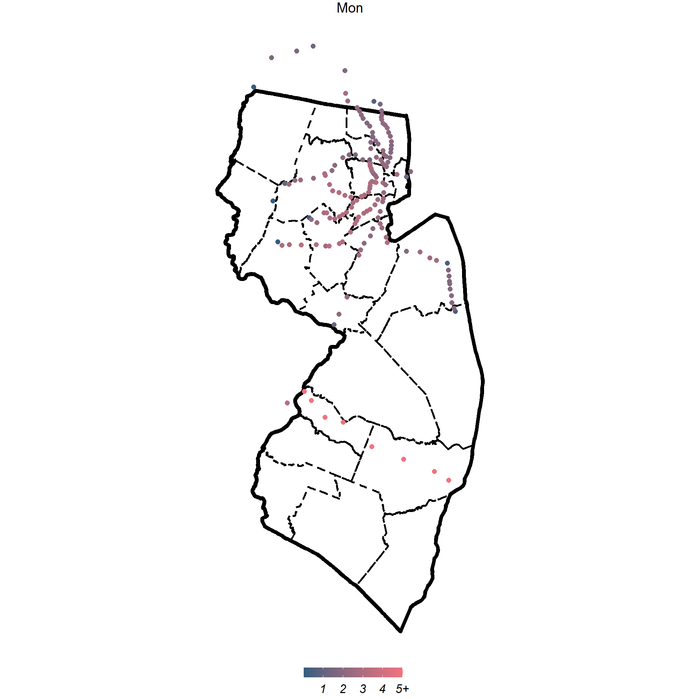
```

#### 5.4 By Station & hour
```{r MAE by hour, eval=FALSE, message=FALSE, warning=FALSE,fig.height = 4,out.width='75%',fig.align='center'}
byStationByHour = 
  finalComparison %>%
  mutate(hour = as.numeric(hour)) %>%
  group_by(station, hour) %>%
  summarize(MAE2h = mean(absErrLong, na.rm = T))

byStationByHourAnimation = 
  byStationByHour %>%
  mutate(MAE2h = ifelse(MAE2h > 5, 5, MAE2h)) %>%
  ggplot() +
  geom_sf(data = st_union(njCounties),
          color='black', size=4, fill = NA)+
  geom_sf(data = njCounties,
          color= 'black', size=2,linetype = 'dashed', fill = NA) +
  geom_sf(aes(color = MAE2h), size = 6) +
  scale_color_gradient(high = brightRed, low = darkBlue,
                       name = '',
                       breaks = c(0, 1, 2, 3, 4, 5),
                       labels = c("0", "1", "2", "3", "4", "5+")) +
  labs(title = '{current_frame}:00 ~ {current_frame}:59') +
  transition_manual(hour) +
  mapTheme(36,40) +
  theme(legend.position = "bottom",
        panel.spacing = unit(12, 'lines'),
        legend.title = element_text(family = 'font', colour = "black", face = "italic", size = 36),
        legend.text = element_text(family = 'font', colour = "black", face = "italic", size = 34),
        legend.key.width = unit(2, 'cm'),
        legend.key.height = unit(1, 'cm'))

anim_save("byStationByHourAnimation.gif", byStationByHourAnimation,
          duration=10, renderer = gifski_renderer(), height = 2000, width = 2000)
```

```{r ReadGif for byStationByHour, echo=FALSE,fig.height = 3,out.width = '50%',fig.align = 'center'}
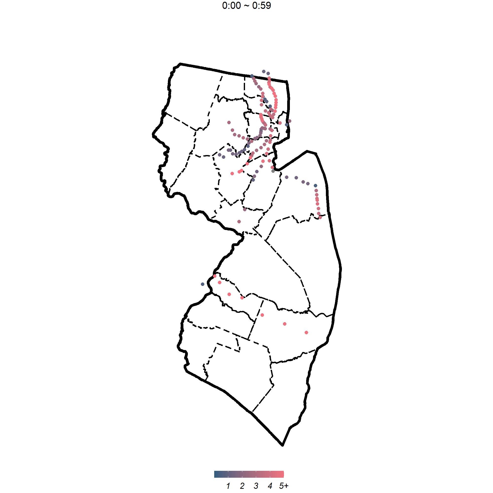
```

#### 5.5 By line

```{r MAE by line, message=FALSE, warning=FALSE}
byLine0 = 
  finalComparison %>%
  st_drop_geometry %>%
  group_by(line) %>%
  summarize(MAE2h = mean(absErrLong, na.rm = T))


byLine = lines %>%
  left_join(byLine0, by = 'line')%>%
  dplyr::select(line, MAE2h)
```


```{r MAE by line2,message=FALSE, warning=FALSE,fig.height = 6,out.width = '75%',fig.align = 'center'}
byLine %>%
  ggplot() +
  geom_sf(data = st_union(njCounties),
          color='black', size=1.5, fill = NA)+
  geom_sf(data = njCounties,
          color= 'black', size=0.5,linetype = 'dashed', fill = NA) +
  geom_sf(aes(color = MAE2h), size = 1.5) +
  scale_color_gradient(high = brightRed, low = darkBlue, name = '') +
  mapTheme()+
  theme(legend.position = "bottom",
        legend.key.width = unit(2, 'cm'),
        legend.key.height = unit(1, 'cm'))
```

#### 5.6 By tile

```{r MAE by tile, ,message=FALSE, warning=FALSE}
finalComparison = finalComparison %>%
  mutate(tile = case_when(obs < 20 ~ "<20 min",
                          obs < 40 ~ "20~40 min",
                          obs < 60 ~ "40~60 min",
                          obs < 80 ~ "60~80 min",
                          obs <= 100 ~ "80~100 min",
                          TRUE ~ ">100 min") %>%
           factor(, levels = c("<20 min", "20~40 min",
                               "40~60 min", "60~80 min",
                               "80~100 min", ">100 min")))

byTile = 
  finalComparison %>%
  group_by(tile) %>%
  summarize(meanObs = mean(obs, na.rm = T),
            meanPredLong = mean(predLong, na.rm = T)) %>%
  st_drop_geometry() %>%
  gather(variable, value, -tile) %>%
  mutate(variable = recode(variable,
                        "meanObs" = "Observed",
                        "meanPred" = "Predicted"))
```


```{r MAE by tile2,message=FALSE, warning=FALSE,fig.height = 4,out.width = '50%',fig.align = 'center',results='hide'}
byTile %>%
  ggplot(aes(tile, value, shape = variable)) +
  geom_point(size = 2,color=palette1_main) +
  geom_path(aes(group = tile), color = palette1_assist) +
  scale_shape_manual(values = c(2, 17), name = "") +
  labs(x = 'Actual mean delay', y = 'Predicted mean delay') +
  plotTheme() +
  theme(legend.position = "bottom")
  theme(axis.text.x = element_text(angle = 90, size = 20, vjust = 0.5, hjust = 1))
```

### 6 Use Case

```{r ReadGif for NJ transit, echo=FALSE,fig.height = 6,out.width = '75%',fig.align = 'center'}
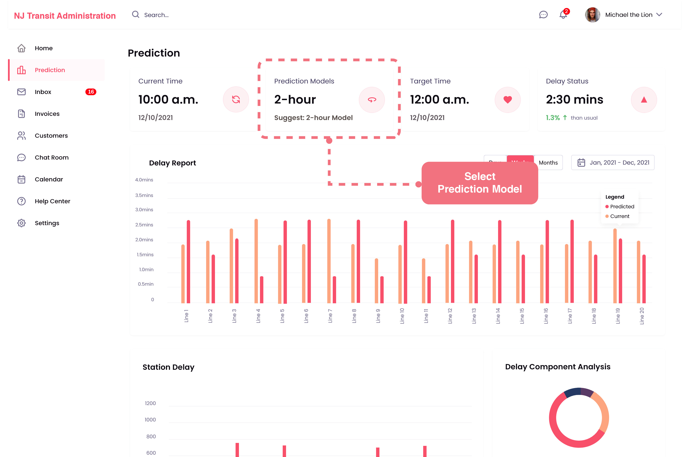
```

```{r ReadGif for NJ transit2, echo=FALSE,fig.height = 6,out.width = '75%',fig.align = 'center'}
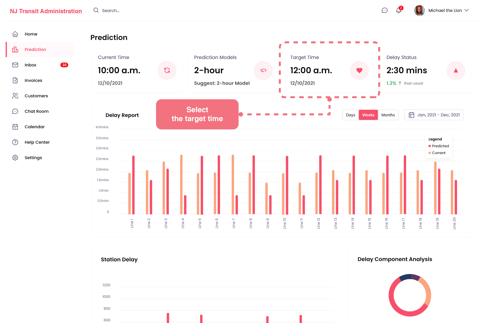
```

```{r ReadGif for NJ transit3, echo=FALSE,fig.height = 6,out.width = '75%',fig.align = 'center'}
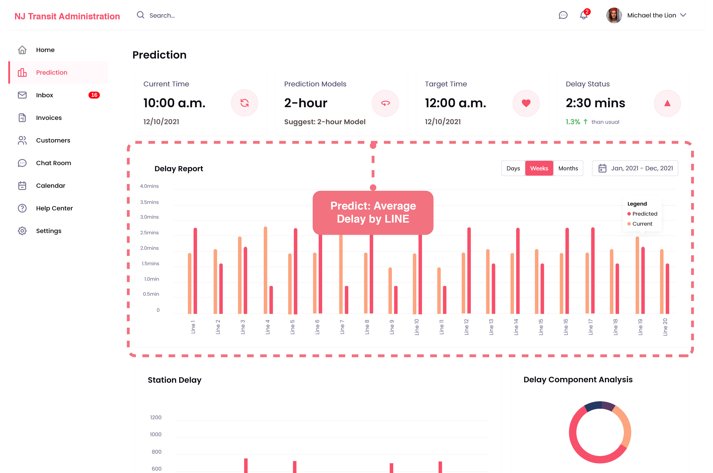
```

```{r ReadGif for NJ transit4, echo=FALSE,fig.height = 6,out.width = '75%',fig.align = 'center'}
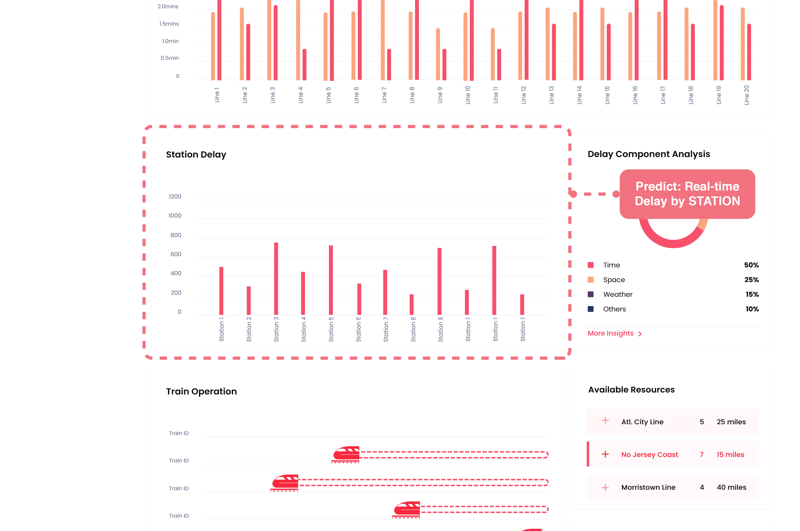
```

```{r ReadGif for NJ transit5, echo=FALSE,fig.height = 6,out.width = '75%',fig.align = 'center'}
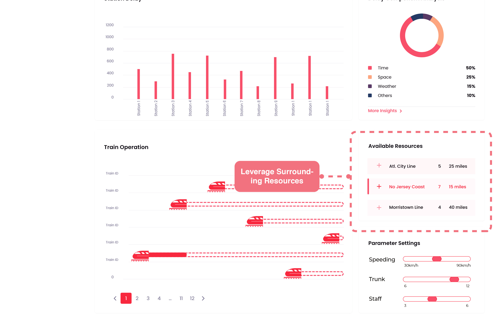
```

```{r ReadGif for NJ transit6, echo=FALSE,fig.height = 6,out.width = '75%',fig.align = 'center'}
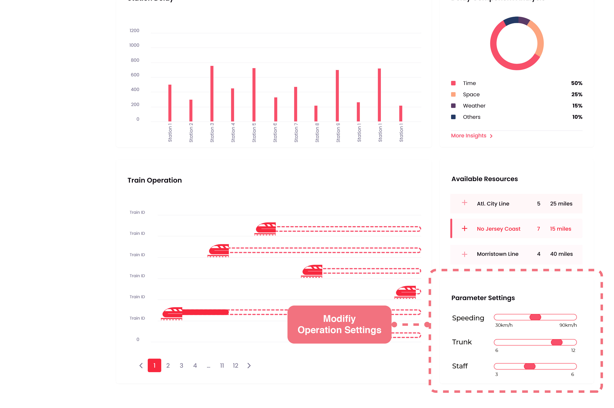
```

```{r ReadGif for NJ transit7, echo=FALSE,fig.height = 6,out.width = '75%',fig.align = 'center'}
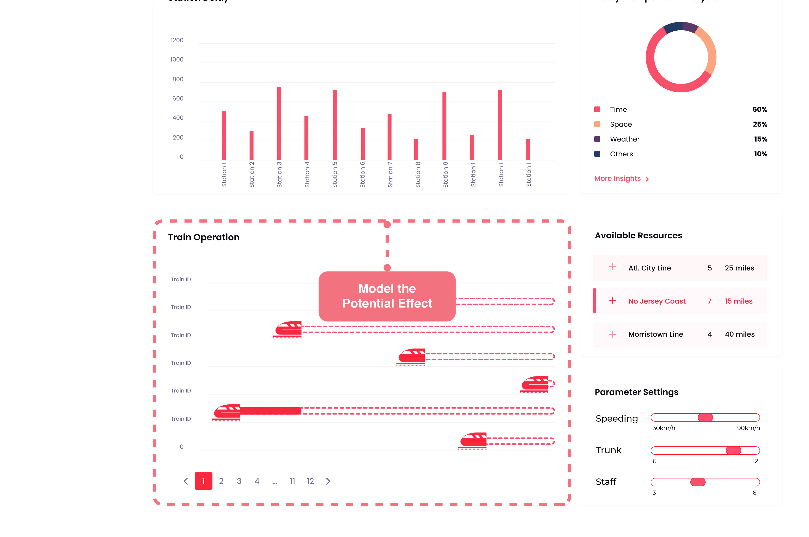
```
