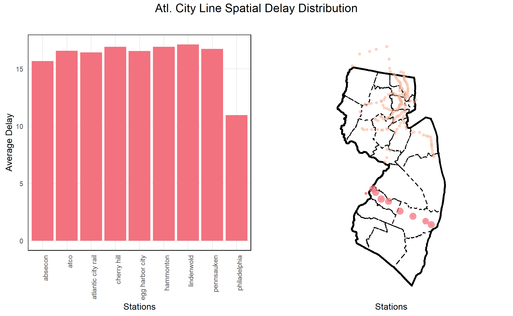
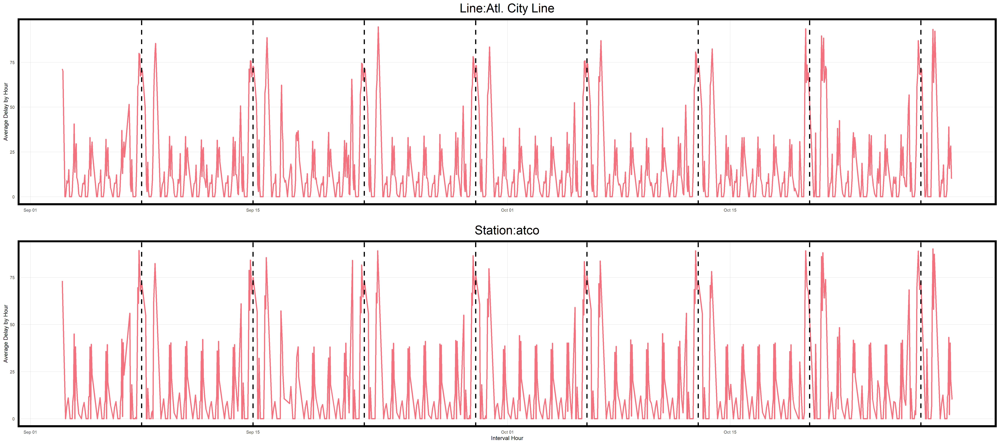

<style>
p.caption {
  font-size: 0.8em;
  text-align: center;
  font-weight: normal;
}
    caption {
      color: grey;
      font-size: 0.8em;
    }
@font-face{
  font-family: Helvetica; 
  src:url('Helvetica.ttf');
}
body{
  font-size: 11pt;
  font-family: Helvetica;
}
h1,h2,h3,h4,h5,h6{
  font-family: Helvetica;
}
td{
  font-size: 9pt;
  font-family: Helvetica;
}
th{
  font-size: 0.8em;
  font-family: Helvetica;
  color: black;
}
</style>
---

```{r setup, include=FALSE}
knitr::opts_chunk$set(echo = TRUE)
```

```{r set_up,message = FALSE, warning = FALSE, results='hide'}
crs = 'EPSG:26913'

library(stringr)
library(tidyverse)
library(sf)
library(lubridate)
library(tigris)
library(gganimate)
library(riem)
library(gridExtra)
library(knitr)
library(kableExtra)
library(FNN)
library(spdep)
library(caret)
library(ckanr)
library(grid)
library(gridExtra)
library(knitr)
library(kableExtra)
library(tidycensus)
library(scales)
library(stargazer)
library(sjPlot)
library(sjmisc)
library(sjlabelled)
library(mapview)
library(ggmap)
library(jsonlite)
library(magick)
library(magrittr)
library(janitor)

root.dir = "https://raw.githubusercontent.com/urbanSpatial/Public-Policy-Analytics-Landing/master/DATA/"
source("https://raw.githubusercontent.com/urbanSpatial/Public-Policy-Analytics-Landing/master/functions.r")

windowsFonts(font = windowsFont('Helvetica'))

ll <- function(dat, proj4 = 4326){st_transform(dat, proj4)}

plotTheme <- function(base_size = 9, title_size = 10){
  theme(
    text = element_text(family = 'font', color = "black"),
    plot.title = element_text(family = 'font',
                              size = title_size, colour = "black", hjust = 0.5), 
    plot.subtitle = element_text(family = 'font', face = 'italic',
                                 size = base_size, colour = "black", hjust = 0.5),
    plot.caption = element_text(family = 'font', hjust=0),
    axis.ticks = element_blank(),
    panel.background = element_blank(),
    panel.grid.major = element_line("grey80", size = 0.01),
    panel.grid.minor = element_blank(),
    panel.border = element_rect(colour = "black", fill=NA, size=.5),
    strip.background = element_blank(),
    strip.text = element_text(family = 'font', size=9),
    axis.title = element_text(family = 'font', size=9),
    axis.text = element_text(family = 'font', size=7),
    axis.text.y = element_text(family = 'font', size=7),
    plot.background = element_blank(),
    legend.background = element_blank(),
    legend.title = element_text(family = 'font', colour = "black", face = "italic", size = 9),
    legend.text = element_text(family = 'font', colour = "black", face = "italic", size = 7),
    strip.text.x = element_text(family = 'font', size = 9),
    legend.key.size = unit(.5, 'line')
  )
}

mapTheme <- function(base_size = 9, title_size = 10){
  theme(
    text = element_text(family = 'font', color = "black"),
    plot.title = element_text(family = 'font',
                              size = title_size, colour = "black", hjust = 0.5), 
    plot.subtitle = element_text(family = 'font', face = 'italic',
                                 size = base_size, colour = "black", hjust = 0.5),
    plot.caption = element_text(family = 'font', hjust=0),
    axis.ticks = element_blank(),
    panel.background = element_blank(),
    panel.grid.major = element_blank(),
    panel.grid.minor = element_blank(),
    panel.border = element_blank(),
    strip.background = element_blank(),
    strip.text = element_text(size=base_size),
    axis.title = element_text(family = 'font', size=9),
    axis.text = element_blank(),
    axis.text.y = element_blank(),
    plot.background = element_blank(),
    legend.background = element_blank(),
    legend.title = element_text(family = 'font', colour = "black", face = "italic", size = 9),
    legend.text = element_text(family = 'font', colour = "black", face = "italic", size = 7),
    strip.text.x = element_text(size=base_size),
    legend.key.size = unit(.5, 'line')
  )
}

brightRed = '#f2727f'
darkBlue = '#315d7f'
palette5 <- c("#f9b294","#f2727f","#c06c86","#6d5c7e","#315d7f")
palette4 <- c("#f9b294","#f2727f","#c06c86","#6d5c7e")
palette2 <- c("#f9b294","#f2727f")
palette1_main <- "#F2727F"
palette1_assist <- '#F9B294'
```

### 1. Motivation

Railway is an important mode of long-distance passenger transport in US. In 2018, number of passengers carried by railways for United States of America was 31,962.7 million passenger-km. New Jersey Transit Corporation, branded as NJ Transit, is a state-owned public transportation system that serves the US state of New Jersey, along with portions of New York State and Pennsylvania. Covering a service area of 5,325 square miles (13,790 km2), NJ Transit is the largest statewide public transit system and the third-largest provider of bus, rail, and light rail transit by ridership in the United States. The important role of railway transport in national economy and citizen benefits has attracted wide-spread attention from both academic and industrial fields.
<br>
<br>
```{r ReadbackgroundPic, echo=FALSE,fig.height = 2,out.width = '50%',fig.align = 'center',fig.cap='A NJ Transit train disabled by a fire at the Princeton Junction in West Windsor in this 2018 file photo.Ed Murray | NJ Advance Media for'}

```
<br>
<br>
However, sadly, NJ Transit trains broke down more than any other system’s in the nation in 2019, ranking the worst in the nation, according to Federal Transit Administration data. Train Delay will not only cause the convenience to people's lives but also cause the financial and social lost to the society. Under this circumstance, for NJ Transit's administration, how to effectively predict and manage the train delay is vital.
<br>
<br>
```{r ReadbackgroundPic2, echo=FALSE,fig.height = 1,out.width = '75%',fig.align = 'center'}

```
<br>
<br>
Our model's use case is based on the NJ Transit company. A model to predict delays ahead of schedule by 2 hours will be made toward NJ Transit. These real time predictions will inform the *DELAY* prediction to the administrator of NJ Transit in this way to help them   better dispatch and manage the train resources (for example, redeploy trains and temporarily accelerate the train speed) so that potential long delays could be avoided. Meanwhile, the long-term model results help identifying problems within the transit network.

```{r geographies&stations, message = FALSE, warning = FALSE, results='hide'}
# County Geographical data
njCounties =
  tigris::counties(state = "34")%>%
  st_transform(crs)%>%
  dplyr::select(GEOID,NAMELSAD,geometry)

# NJ Transit station data
njStations = st_read('https://opendata.arcgis.com/datasets/4809dada94c542e0beff00600ee930f6_0.geojson') %>%
  st_transform(crs) %>%
  dplyr::select(station = STATION_ID, geometry) %>%
  # Trying to standardize the station names...
  mutate(station = tolower(station)) %>%
  mutate(station = 
           case_when(
             # str_detect(station, '-') ~
             #   substr(station, 1, str_locate(station, '-')[[1]] - 1),
             substr(station, nchar(station) - 15, nchar(station)) == ' railway station'~
               substr(station, 1, nchar(station) - 16),
             substr(station, nchar(station) - 12, nchar(station)) == ' rail station'~
               substr(station, 1, nchar(station) - 13),
             substr(station, nchar(station) - 7, nchar(station)) == ' station' ~
               substr(station, 1, nchar(station) - 8),
             substr(station, nchar(station) - 8, nchar(station)) == ' terminal' ~
               substr(station, 1, nchar(station) - 9),
             TRUE ~ station
           )) %>%
  mutate(joined = 1)

# Further modifying station names
njStations[12, 1] = 'middletown nj'
njStations[149, 1] = 'middletown ny'
njStations[131, 1] = 'anderson street'
njStations[99, 1] = 'atlantic city rail'
njStations[87, 1] = 'bay street'
njStations[134, 1] = 'wood ridge'
njStations[90, 1] = 'watsessing avenue'
njStations[133, 1] = 'teterboro'
njStations[159, 1] = 'secaucus upper lvl'
njStations[166, 1] = 'secaucus lower lvl'
njStations[102, 1] = 'ramsey main st'
njStations[156, 1] = 'ramsey route 17'
njStations[102, 1] = 'ramsey main st'
njStations[115, 1] = 'radburn fair lawn'
njStations[140, 1] = 'princeton junction'
njStations[92, 1] = 'philadelphia'
njStations[165, 1] = 'pennsauken'
njStations[80, 1] = 'mountain view'
njStations[163, 1] = 'mount arlington'
njStations[158, 1] = 'montclair state u'
njStations[107, 1] = 'glen rock main line'
njStations[114, 1] = 'glen rock boro hall'
njStations[116, 1] = 'broadway fair lawn'
njStations[132, 1] = 'essex street'

# Line
lines = rbind(
  st_read('https://services6.arcgis.com/M0t0HPE53pFK525U/arcgis/rest/services/NJTransit_Rail_Linea/FeatureServer/0/query?outFields=*&where=1%3D1&f=geojson') %>%
    st_transform(crs) %>%
    mutate(line = 'Northeast Corrdr') %>%
    dplyr::select(line),
  st_read('https://services6.arcgis.com/M0t0HPE53pFK525U/arcgis/rest/services/NJTransit_Rail_Linea/FeatureServer/6/query?outFields=*&where=1%3D1&f=geojson') %>%
    st_transform(crs) %>%
    mutate(line = 'Atl. City Line') %>%
    dplyr::select(line),
  st_read('https://services6.arcgis.com/M0t0HPE53pFK525U/arcgis/rest/services/NJTransit_Rail_Linea/FeatureServer/7/query?outFields=*&where=1%3D1&f=geojson') %>%
    st_transform(crs) %>%
    mutate(line = 'Bergen Co. Line ') %>%
    dplyr::select(line),
  st_read('https://services6.arcgis.com/M0t0HPE53pFK525U/arcgis/rest/services/NJTransit_Rail_Linea/FeatureServer/9/query?outFields=*&where=1%3D1&f=geojson') %>%
    st_transform(crs) %>%
    mutate(line = 'Gladstone Branch') %>%
    dplyr::select(line),
  st_read('https://services6.arcgis.com/M0t0HPE53pFK525U/arcgis/rest/services/NJTransit_Rail_Linea/FeatureServer/4/query?outFields=*&where=1%3D1&f=geojson') %>%
    st_transform(crs) %>%
    mutate(line = 'Main Line') %>%
    dplyr::select(line),
  st_read('https://services6.arcgis.com/M0t0HPE53pFK525U/arcgis/rest/services/NJTransit_Rail_Linea/FeatureServer/8/query?outFields=*&where=1%3D1&f=geojson') %>%
    st_transform(crs) %>%
    mutate(line = 'Montclair-Boonton') %>%
    dplyr::select(line),
  st_read('https://services6.arcgis.com/M0t0HPE53pFK525U/arcgis/rest/services/NJTransit_Rail_Linea/FeatureServer/3/query?outFields=*&where=1%3D1&f=geojson') %>%
    st_transform(crs) %>%
    mutate(line = 'Morristown Line') %>%
    dplyr::select(line),
  st_read('https://services6.arcgis.com/M0t0HPE53pFK525U/arcgis/rest/services/NJTransit_Rail_Linea/FeatureServer/10/query?outFields=*&where=1%3D1&f=geojson') %>%
    st_transform(crs) %>%
    mutate(line = 'No Jersey Coast') %>%
    dplyr::select(line),
  st_read('https://services6.arcgis.com/M0t0HPE53pFK525U/arcgis/rest/services/NJTransit_Rail_Linea/FeatureServer/12/query?outFields=*&where=1%3D1&f=geojson') %>%
    st_transform(crs) %>%
    mutate(line = 'Pascack Valley') %>%
    dplyr::select(line),
  st_read('https://services6.arcgis.com/M0t0HPE53pFK525U/arcgis/rest/services/NJTransit_Rail_Linea/FeatureServer/11/query?outFields=*&where=1%3D1&f=geojson') %>%
    st_transform(crs) %>%
    mutate(line = 'Raritan Valley') %>%
    dplyr::select(line)
)
```

```{r stations_exploratory_plot,fig.height = 5,message = FALSE, warning = FALSE, results='hide',out.width = '75%',fig.align = 'center'}
base_map <- get_map(location = unname(st_bbox(ll(st_buffer(st_union(njCounties),11000)))),maptype = "terrian")

ggmap(base_map) + 
  geom_sf(data=ll(st_union(njCounties)),color="black",size=1.2,fill = "transparent",inherit.aes = FALSE)+
  geom_sf(data=ll(njCounties),color="black",size=0.5,linetype ="dashed",fill = "transparent",inherit.aes = FALSE)+
  geom_sf(data=ll(lines),size=1.5,color=palette1_main,inherit.aes = FALSE)+
  labs(title = "Map of NJ Transit Railway Stations", 
       subtitle = "Red dots are stations",
       x="",y="")+
  mapTheme()

```
<br>
<br>
In the above graph, we can see the geographical distribution of NJ Transit stations are mainly in the north-east of New Jersey, close to New York.

### 2. Exploratory Analysis

Data of NJ Transit Train Delay in September and October of 2019 are used. For further operation, stations' names are standardized. In this section, several exploratory analysis will be done to explained concepts, phenomenons, and patterns.

```{r read_trains_data, message = FALSE, warning = FALSE, results='hide'}
# 2019.9
trainsSep = read.csv('2019_09.csv') %>%
  filter(., type == 'NJ Transit' & status == 'departed' &
           line != 'Princeton Shuttle') %>%
  mutate(date = ymd(date),
         scheduled_time = ymd_hms(scheduled_time),
         actual_time = ymd_hms(actual_time)) %>%
  dplyr::select(-status,-type)

# 2019.10
trainsOct = read.csv('2019_10.csv') %>%
  filter(., type == 'NJ Transit' & status == 'departed' &
           line != 'Princeton Shuttle') %>%
  mutate(date = ymd(date),
         scheduled_time = ymd_hms(scheduled_time),
         actual_time = ymd_hms(actual_time)) %>%
  arrange(stop_sequence) %>%
  dplyr::select(-status,-type)

# Bind the two-month data
trains = rbind(trainsSep, trainsOct) %>%
  # Trying to standardize station names
  mutate(to = tolower(to),
         from = tolower(from)) 

# Standardize names
trainsWithGeometry = trains %>%
  filter(., to != 'secaucus concourse') %>%
  mutate(to = 
           case_when(
             str_detect(to, '-') ~
               substr(to, 1, str_locate(to, '-')[[1]] - 1),
             substr(to, nchar(to) - 15, nchar(to)) == ' railway station'~
               substr(to, 1, nchar(to) - 16),
             substr(to, nchar(to) - 12, nchar(to)) == ' rail station'~
               substr(to, 1, nchar(to) - 13),
             substr(to, nchar(to) - 7, nchar(to)) == ' station' ~
               substr(to, 1, nchar(to) - 8),
             substr(to, nchar(to) - 8, nchar(to)) == ' terminal' ~
               substr(to, 1, nchar(to) - 9),
             TRUE ~ to
           ),
         from = 
           case_when(
             str_detect(from, '-') ~
               substr(from, 1, str_locate(from, '-')[[1]] - 1),
             substr(from, nchar(from) - 15, nchar(from)) == ' railway station'~
               substr(from, 1, nchar(from) - 16),
             substr(from, nchar(from) - 12, nchar(from)) == ' rail station'~
               substr(from, 1, nchar(from) - 13),
             substr(from, nchar(from) - 7, nchar(from)) == ' station' ~
               substr(from, 1, nchar(from) - 8),
             substr(from, nchar(from) - 8, nchar(from)) == ' terminal' ~
               substr(from, 1, nchar(from) - 9),TRUE ~ from
           )) %>%
  left_join(njStations, by = c('to' = 'station')) %>%
  st_sf() %>%
  dplyr::select(-joined)
```

#### 2.1 What is trainID?

When the data set of NJ Transit is firstly obtained, the exact characters of field **"TrainID"** is confusing. To model the prediction, we need to understand the basic unit of rail transportation, TrainID. The following section will emphasize on that to clarify "TrainID". 

```{r illustrate trainID and express line,message = FALSE, warning = FALSE, results='hide'}
# A trainID is for a whole trip
trainIDforWholeTrip = trains%>%
  filter(train_id == 7824, date == "2019-10-06")%>%
  arrange(date, train_id)%>%
  dplyr::select(train_id,stop_sequence,from,to,line)
trainIDforWholeTrip = trainIDforWholeTrip[1:5,]
# Different TrainIDs is within the same day & Express or normal lines
difTrainIDs = trains%>%
  filter(line=="Northeast Corrdr",date=="2019-10-06",stop_sequence=="2")%>%
  arrange(date,train_id)%>%
  dplyr::select(scheduled_time,train_id,from,to,line)
difTrainIDs = difTrainIDs[1:5,]

# A TrainID is allocated for the specific time slot train everyday or more
TrainIDforDifDay = trains%>%
  filter(line=="Northeast Corrdr",train_id==7824,stop_sequence=="2")%>%
  arrange(date,to)%>%
  dplyr::select(scheduled_time,train_id,from,to,line)
TrainIDforDifDay = TrainIDforDifDay[1:5,]
```

```{r talbe1 for illustrate trainID and express line, echo=FALSE,fig.height=1, results='asis'}
kable(trainIDforWholeTrip,align = 'c',caption = '<center>A trainID for a whole trip</center>',table.attr = "style='width:75%;'")%>%
  kable_classic(full_width = T)%>%
  kable_styling(position = "center")%>%
  column_spec(2, bold = T,color = palette1_assist)%>%
  column_spec(3, bold = T,color = palette1_main)
```

From the first table, we can know that a trainID is costatnt for a whole trip, from first station to the last station of the line.

```{r talbe2 for illustrate trainID and express line, echo=FALSE,fig.height=1, results='asis'}
kable(difTrainIDs,align = 'c',caption = '<center>Table.Different TrainIDs within the same day & Express or normal lines</center>',table.attr = "style='width:75%;'")%>%
  kable_classic(full_width = T)%>%
  kable_styling(position = "center")%>%
  column_spec(2, bold = T,color = palette1_assist)%>%
  row_spec(2, bold = T,color = palette1_main)%>%
  row_spec(3, bold = T,color = palette1_main)
```

From this table, we can know that for a same transit line, different trainIDs will be used within the same day. And even for the same trainsit line, there are several sublines, which have various initial station, terminal station, and routes.

```{r talbe3 for illustrate trainID and express line, echo=FALSE,fig.height=1, results='asis'}
kable(TrainIDforDifDay,align = 'c',caption = '<center>Table.A TrainID is allocated for the specific time slot everyday</center>',table.attr = "style='width:75%;'")%>%
  kable_classic(full_width = T)%>%
  kable_styling(position = "center")%>%
  column_spec(2, bold = T,color = palette1_main)%>%
  column_spec(1,bold = T,color = palette1_assist)
```

From this table, we can know that a TrainID is allocated for the trains which run at specific same scheduled time everyday with the same route.

Besides, based on above insights, Should we divide the sublines of every transit line? In theory, detailed sublines may make observation more accurate and prediction more accurate. However, following graph displays the convoluted of the division. About 59 sublines will be needed to distinguish the sublines. That will bring unescessary redudancy.

```{r distinguish sublines, message = FALSE, warning = FALSE, results='asis',fig.height=1, results='asis'}
# Distinguish Express and normal lines
trains_analysis_subline = trains%>%
  filter(from != to)%>%
  filter(from !="secaucus concourse" & to!="secaucus upper lvl")%>%
  filter(from !="east orange" & to!="brick church")%>%
  filter(from !="new york penn station" & to!="maplewood")

lineList = unique(trains_analysis_subline$line)
for (k in lineList) {
  LineTool = trains_analysis_subline%>%
    filter(line==k,stop_sequence=="2")%>%
    arrange(date,train_id)%>%
    group_by(from,to,train_id)%>%
    summarise()
  listFrom = unique(LineTool$from)
  listTo = unique(LineTool$to)
  n = 1
  for (i in listFrom){
    for (j in listTo) {
      EvLine = filter(LineTool,from==i & to==j)
      listTrainID = unique(EvLine$train_id)
      if (length(listTrainID>0)){
        trains_analysis_subline = trains_analysis_subline%>%mutate(line = case_when(train_id %in% listTrainID ~ paste(line,n, sep = "_subline_"),TRUE ~ line))
        n = n+1}}}}

trains_analysis_subline <- as.data.frame(unique(trains_analysis_subline$line))%>%
  rename("sublineList" = "unique(trains_analysis_subline$line)")%>%
  arrange(sublineList)

i=1
a=1
tableForSublines <- data.frame(matrix(NA,nrow=10))
tmp1  <- trains_analysis_subline[c(1:3),]
tmp2  <- trains_analysis_subline[c(4:9),]
tmp3  <- trains_analysis_subline[c(10:14),]
tmp4  <- trains_analysis_subline[c(15:19),]
tmp5  <- trains_analysis_subline[20,]
tmp6  <- trains_analysis_subline[c(21:27),]
tmp7  <- trains_analysis_subline[c(28:36),]
tmp8  <- trains_analysis_subline[c(37:43),]
tmp9  <- trains_analysis_subline[c(44:50),]
tmp10  <- trains_analysis_subline[c(51:53),]
tmp11  <- trains_analysis_subline[c(54:59),]
length(tmp1) = length(c(1:10))
length(tmp2) = length(c(1:10))
length(tmp3) = length(c(1:10))
length(tmp4) = length(c(1:10))
length(tmp5) = length(c(1:10))
length(tmp6) = length(c(1:10))
length(tmp7) = length(c(1:10))
length(tmp8) = length(c(1:10))
length(tmp9) = length(c(1:10))
length(tmp10) = length(c(1:10))
length(tmp11) = length(c(1:10))
tableForSublines <- cbind(tableForSublines, tmp5) 
tableForSublines <- cbind(tableForSublines, tmp10) 
tableForSublines <- cbind(tableForSublines, tmp1) 
tableForSublines <- cbind(tableForSublines, tmp3) 
tableForSublines <- cbind(tableForSublines, tmp4) 
tableForSublines <- cbind(tableForSublines, tmp2) 
tableForSublines <- cbind(tableForSublines, tmp11) 
tableForSublines <- cbind(tableForSublines, tmp6) 
tableForSublines <- cbind(tableForSublines, tmp8) 
tableForSublines <- cbind(tableForSublines, tmp9) 
tableForSublines <- cbind(tableForSublines, tmp7) 

tableForSublines = tableForSublines%>%row_to_names(row_number = 1)
tableForSublines = tableForSublines[1:5,7:12]
tableForSublines[is.na(tableForSublines)] = ""

kable(tableForSublines,align = 'c',caption = '<center>Differnet sublines for NJ Transit</center>',table.attr = "style='width:75%;'")%>%
  kable_classic(full_width = T)%>%
  kable_styling(position = "center")%>%
  row_spec(0, bold = T,color = palette1_main)
```

#### 2.2 Average delay time by lines and by stations

In the following, average delay time for different train lines and different train stations within the same line are respectively plot to analyze the pattern of it. That will give instructions on how to select predictors and models for the delay time...

```{r Average delay time,message = FALSE, warning = FALSE, results='hide'}
# Average delay time for different train lines
plot1 <- trainsWithGeometry%>%
  st_drop_geometry()%>%
  dplyr::select(delay_minutes,line)%>%
  na.omit()%>%
  group_by(line)%>%
  summarise(averageDelay=mean(delay_minutes))%>%
  ggplot(aes(line,averageDelay))+
  geom_bar(fill=palette1_main,position ="dodge", stat ="summary", fun ="mean")+
  labs(title = "",x="Lines",y="Average Delay")+
  plotTheme(5,10)+
  theme(legend.position = "none",
        axis.text.x = element_text(angle = 90, hjust = 1),
        panel.spacing = unit(2, 'lines'),
        panel.border = element_rect(colour = "black", fill=NA, size=.5))

plot2 <- trainsWithGeometry%>%
  dplyr::select(to,delay_minutes,line)%>%
  na.omit()%>%
  group_by(line)%>%
  summarise(averageDelay=mean(delay_minutes))%>%
  st_drop_geometry()

byLine2 = lines %>%
  left_join(plot2, by = 'line')%>%
  ggplot()+
  geom_sf(data=st_union(njCounties),color="black",size=1,fill = "transparent")+
  geom_sf(data=njCounties,color="black",size=0.5,linetype ="dashed",fill = "transparent")+
  geom_sf(aes(color=averageDelay),alpha=0.7,size=.75)+
  scale_color_gradient(high = brightRed, low = darkBlue, name = '') +
  labs(title = "",x="Stations",y="")+
  mapTheme(5,10)+
  theme(legend.position = "none")

grid.arrange(plot1, byLine2,ncol=2,top = paste("All Lines"," Spatial Delay Distribution",sep = ""))
```


```{r Average delay time2,message = FALSE, warning = FALSE, results='hide',eval=FALSE}
# Average delay time for different train stations within the same line
linelist <- unique(trainsWithGeometry$line)

for (i in linelist){
plot1 <- trainsWithGeometry%>%
  st_drop_geometry()%>%
  dplyr::select(to,delay_minutes,line)%>%
  na.omit()%>%
  group_by(to,line)%>%
  summarise(averageDelay=mean(delay_minutes))%>%
  filter(line == i)%>%
  ggplot(aes(to,averageDelay))+
  geom_bar(fill=palette1_main,position ="dodge", stat ="summary", fun ="mean")+
  labs(title = "",x="Stations",y="Average Delay")+
  plotTheme(5,10)+
  theme(legend.position = "none",
        axis.text.x = element_text(angle = 90, hjust = 1),
        panel.spacing = unit(2, 'lines'),
        panel.border = element_rect(colour = "black", fill=NA, size=.5))

plot2 <- trainsWithGeometry%>%
  dplyr::select(to,delay_minutes,line)%>%
  na.omit()%>%
  group_by(to,line)%>%
  summarise(averageDelay=mean(delay_minutes))%>%
  filter(line == i)%>%
  ggplot()+
  geom_sf(data=st_union(njCounties),color="black",size=1,fill = "transparent")+
  geom_sf(data=njCounties,color="black",size=0.5,linetype ="dashed",fill = "transparent")+
  geom_sf(data=njStations,size=1,color=palette1_assist,alpha=0.5)+
  geom_sf(aes(size=averageDelay),color=palette1_main,alpha=0.7)+
  scale_size_continuous(range = c(1, 3))+
  labs(title = "",x="Stations",y="")+
  mapTheme(5,10)+
  theme(legend.position = "none")

g <- arrangeGrob(plot1, plot2,ncol=2,top = paste(i," Spatial Delay Distribution",sep = ""))
ggsave(path="../geo",paste(i,"geo.png",sep = ""),g)}

# list.files(path="./geo",pattern = '*.png', full.names = TRUE) %>% 
#         image_read() %>% 
#         image_join() %>% 
#         image_animate(fps=1) %>% 
#         image_write("./geo/allLines.gif")
```

```{r ReadGif for alllines, echo=FALSE,fig.height = 3,out.width = '75%',fig.align = 'center'}

```

The previous graphs reveals different average delays across lines and stations, suggesting that the line and station are important factors to predict delays. Especially, we find that the Atlantic City Line, which is detached from the main network, is an outlier with an average delay length four times compared to the rest...

#### 2.3 Delay time in the scale of time

In the following, delay time, in the scale of time, for different train lines and different train stations within the same line are respectively plot to analyze the periodic pattern of it. That will give instructions on how to select predictors and models for the delay time...

```{r lineChart in the scale of time, message = FALSE, warning = FALSE, results='hide',eval=FALSE,fig.width=9,fig.height=4}
monday <-trainsWithGeometry%>%
  st_drop_geometry()%>%
  filter(line=="No Jersey Coast")%>%
  na.omit()%>%
  mutate(interval_hour = ymd_h(substr(scheduled_time, 1, 13)),
         dayotw = wday(scheduled_time),
         week = week(scheduled_time),
         hour = hour(scheduled_time))%>%
  arrange(dayotw,interval_hour)%>%
  filter(week%in%(36:43))%>%
  mutate(monday = ifelse(dayotw == 1 & hour == 0,interval_hour, 0)) %>%
  filter(monday != 0)

linelist <- unique(trainsWithGeometry$line)

for (i in linelist){
  
plot1 <- trainsWithGeometry%>%
  st_drop_geometry()%>%
  filter(line==i)%>%
  na.omit()%>%
  mutate(interval_hour = ymd_h(substr(scheduled_time, 1, 13)),
         week = week(scheduled_time))%>%
  filter(week%in%(36:43))%>%
  group_by(interval_hour,line,date)%>%
  summarise(AverageDelayInHour = mean(delay_minutes))%>%
  ggplot(aes(interval_hour,AverageDelayInHour)) + 
  geom_line(color=palette1_main,size=1)+
  geom_vline(data = monday, aes(xintercept = interval_hour),linetype = "dashed",size=1)+
  labs(title = paste("Line:",i,sep = ""),x='',y="Average Delay by Hour")+
  plotTheme(10,20)+
  theme(panel.border = element_rect(colour = "black", fill=NA, size=3))

stationlist <- trainsWithGeometry%>%filter(line==i)
stationlist <- unique(stationlist$to)
for (j in stationlist){
plot2 <- trainsWithGeometry%>%
  st_drop_geometry()%>%
  filter(line==i & to==j)%>%
  na.omit()%>%
  mutate(interval_hour = ymd_h(substr(scheduled_time, 1, 13)),
         week = week(scheduled_time))%>%
  filter(week%in%(36:43))%>%
  group_by(interval_hour,date)%>%
  summarise(AverageDelayInHour = mean(delay_minutes))%>%
  ggplot(aes(interval_hour,AverageDelayInHour)) + 
  geom_line(color=palette1_main,size=1)+
  geom_vline(data = monday, aes(xintercept = interval_hour),linetype = "dashed",size=1)+
  labs(title = paste("Station:",j,sep = ""),x="Interval Hour",y="Average Delay by Hour")+
  plotTheme(10,20)+
  theme(panel.border = element_rect(colour = "black", fill=NA, size=3))

g <- arrangeGrob(plot1, plot2,ncol=1)
ggsave(path="../temporal",paste(i,j,"_temporal.png",sep = "_"),g)}}

# list.files(path="../temporal/select",pattern = '*.png', full.names = TRUE) %>%
#         image_read() %>% # reads each path file
#         image_join() %>% # joins image
#         image_animate(fps=1) %>% # animates, can opt for number of loops
#         image_write("../temporal/select") # write to current dir
```

```{r ReadGif for alltemporal, echo=FALSE,fig.height = 6,out.width = '75%',fig.align = 'center'}

```

The above graphs show delays follow periodic cycles of hours and days, suggesting that the hour and day-of-week fixed-effects should be employed in the model. On the other hand, the temporal patterns vary across different stations and lines. Therefore, delay time-lags of the line and station are also included in our model.

### 3 Feature Engineering

Firstly, features related to transit operations are added into the models. This engineering mainly comes from THREE parts. Station, line and train.

```{r feature engineering, eval=FALSE, message=FALSE, warning=FALSE, results='hide'}
### Delays on this line two hours prior
# Add a field: time of prediction
trains = trains %>%
  mutate(timeOfPrediction = scheduled_time - hours(2))

timeLagBase = 
  trains %>%
  dplyr::select(date, line, actual_time, delay_minutes)

findLagDelay = function(timeOfPrediction, line, date){
  narrowDown = 
    timeLagBase[timeLagBase$line == line &
                  timeLagBase$date == date &
                  difftime(timeOfPrediction,
                           timeLagBase$actual_time,
                           units = 'secs') > 0,] %>%
    arrange(desc(actual_time))
  return(narrowDown[1, 4])
}

# Add lag delay data
for(i in 1:nrow(trains)){
  date = trains[i, 'date']
  line = trains[i, 'line']
  timeOfPrediction = trains[i, 'timeOfPrediction']
  lagDelay = findLagDelay(timeOfPrediction, line, date)
  trains[i, 'lagDelay'] = lagDelay
  if(i %% 1000 == 0){
    print(i)
  }
}


### Station-based average delay (2-hour lag)
trains = trains %>% filter(., !is.na(stop_sequence))
stationAvgDelayBase = trains %>% 
  dplyr::select(station = to, actual_time, delay_minutes) %>%
  mutate(actual_time = ymd_hms(actual_time))

findAvgStationDelay = function(timeOfPrediction, depStation){
  narrowDown = 
    stationAvgDelayBase %>%
    filter(., station == depStation &
             actual_time %within% interval(timeOfPrediction - hours(1), timeOfPrediction))
  return(mean(narrowDown$delay_minutes, na.rm = T))
}

# Add station lag delay data
for(i in 1:nrow(trains)){
  depStation = trains[i, 'to']
  timeOfPrediction = trains[i, 'timeOfPrediction']
  stationDelay = findAvgStationDelay(timeOfPrediction, depStation)
  trains[i, 'stationDelay'] = stationDelay
  if(i %% 1000 == 0){
    print(i)
  }
}

### Delay station average 2 hours lag 1 station
# Add data
for(i in 1:nrow(trains)){
  depStation = trains[i, 'from']
  timeOfPrediction = trains[i, 'timeOfPrediction']
  lag1StationDelay = findAvgStationDelay(timeOfPrediction, depStation)
  trains[i, 'lag1StationDelay'] = lag1StationDelay
  if(i %% 1000 == 0){
    print(i)
  }
}

### Delay station average 2 hours lag 2 stations
lastStation = 
  trains %>%
  dplyr::select(date, train = train_id, sequence = stop_sequence, lag2Station = from) %>%
  mutate(sequencePlus = sequence + 1) %>%
  dplyr::select(-sequence)

trains =
  left_join(trains, lastStation, by = c('date' = 'date',
                                'train_id' = 'train',
                                'stop_sequence' = 'sequencePlus')) %>%
  mutate(lag2Station = ifelse(is.na(lag2Station), from, lag2Station))

# Add data
for(i in 1:nrow(trains)){
  depStation = trains[i, 'lag2Station']
  timeOfPrediction = trains[i, 'timeOfPrediction']
  lag2StationDelay = findAvgStationDelay(timeOfPrediction, depStation)
  trains[i, 'lag2StationDelay'] = lag2StationDelay
  if(i %% 1000 == 0){
    print(i)
  }
}

### Lag one day
trains = 
  trains %>%
  group_by(train_id, to) %>%
  arrange(scheduled_time) %>%
  mutate(lagDelayDayPlus = lag(delay_minutes, 1)) %>%
  ungroup() %>%
  mutate(actualTime = ymd_hms(actual_time),
         scheduledTime = ymd_hms(scheduled_time),
         date = ymd(date)) %>%
  rename(delay = delay_minutes, train = train_id)

write.csv(trains, 'trains.csv')
```

```{r readCSV, warning=FALSE, include=FALSE, message=FALSE, results='hide'}
trains = read.csv('trains.csv') %>% dplyr::select(-X) %>%
  mutate(timeOfPrediction = ymd_hms(timeOfPrediction),
         date = ymd(date),
         scheduled_time = ymd_hms(scheduled_time),
         actual_time = ymd_hms(actual_time))
```

```{r correlationplot, message=FALSE, warning=FALSE,fig.width=10,fig.height=7,out.width='75%',fig.align = 'center'}
lagVarScatter <- trains%>%
  dplyr::select(delay,lagDelay,stationDelay,lag1StationDelay,lag2StationDelay,lagDelayDayPlus)%>%
  gather(Variable, Value, -delay) %>%
  mutate(Variable = fct_relevel(Variable,"Realtime Lag Delay","Average Station Delay","LagOneStationDelay","LagTwoStationDelay","LagDelayDayPlus"))

correlation.lag <-
  group_by(lagVarScatter, Variable) %>%
  summarize(correlation = round(cor(Value, delay,
                                    use = "complete.obs"), 2))

ggplot(lagVarScatter%>% sample_n(30000), aes(Value, delay)) +
  geom_point(size = .1, color = palette1_main) +
  geom_text(data = correlation.lag,aes(label = paste("r =", round(correlation, 2))),x=-Inf, y=Inf, vjust = 2, hjust = -.5,size=4) +
  geom_smooth(method = "lm", se = FALSE, colour = palette1_assist,size=1) +
  facet_wrap(~Variable, ncol = 3, scales = "free") +
  labs(
    x="Lag Trip Count",y="Delay",
    title = "Rideshare trip count as a function of time lags") +
  plotTheme()
```

This line’s delay `lagDelay`, This station’s delay`stationDelay`, Previous station’s delay`lag1StationDelay`, Previous of previous station’s delay`lag2StationDelay`, and previous delay of same train at same station`lagDelayDayPlus` are modeled into the model.
In the following, Weather data is also added into the model.

```{r weather_data,warning=FALSE, message=FALSE, results='hide'}
# Weather
network = riem_networks()
weatherStations = riem_stations(network = 'NJ_ASOS') %>%
  st_as_sf(coords = c('lon', 'lat'), crs = 4326, agr = 'constant') %>%
  st_transform(crs)
weatherStations$weatherStationIndex = row.names(weatherStations) %>% as.numeric()

njStations$weatherStationIndex =
  get.knnx(
  st_coordinates(weatherStations), 
  st_coordinates(njStations), 1)$nn.index

# Determine which weather station for which transit station
njStations = njStations %>%
  left_join(st_drop_geometry(weatherStations) %>%
              dplyr::select(weatherStationID = id, weatherStationIndex), 
            by = 'weatherStationIndex')

# Add weatherStationID
trains = trains %>%
  filter(., to != 'secaucus concourse') %>%
  left_join(njStations, by = c('to' = 'station')) %>%
  st_sf() %>%
  dplyr::select(-joined, -weatherStationIndex)

# Get weather Data
weatherStationList = unique(trains$weatherStationID)
weather = data.frame()
for(i in weatherStationList){
  weatherSeg = riem_measures(station = i, 
                          date_start = '2019-09-01',
                          date_end = '2019-10-31') %>%
    mutate_if(is.character, list(~replace(as.character(.), is.na(.), "0"))) %>%
    replace(is.na(.), 0) %>%
    mutate(hour = ymd_h(substr(valid, 1, 13))) %>%
    mutate(week = week(hour),
           dayOfWeek = wday(hour, label = T)) %>%
    group_by(hour) %>%
    summarize(temp = max(tmpf),
              precip = sum(p01i),
              windSpeed = max(sknt)) %>%
    mutate(temp = ifelse(temp == 0, 42, temp)) %>%
    mutate(precip = ifelse(precip > 0, precip, 0)) %>%
    mutate(weatherStationID = i)
  weather = rbind(weather, weatherSeg)
}

# Join Data
trains$timeHour = floor_date(trains$scheduled_time, unit = 'hour')
trains = trains %>%
  left_join(weather,
            by = c('weatherStationID' = 'weatherStationID',
                   'timeHour' = 'hour'))%>%
  st_sf()
```

```{r Weather Variables plot, message=FALSE, warning=FALSE,fig.width=10,fig.height=3.5,out.width='75%',fig.align = 'center'}
weatherVarScatter <- trains%>%
  st_drop_geometry()%>%
  dplyr::select(delay,temp,precip,windSpeed)%>%
  gather(Variable, Value, -delay) 

correlation.lag <-
  group_by(weatherVarScatter, Variable) %>%
  summarize(correlation = round(cor(Value, delay,
                                    use = "complete.obs"), 2))
ggplot(weatherVarScatter%>% sample_n(30000), aes(Value, delay)) +
  geom_point(size = .1, color = palette1_main) +
  geom_text(data = correlation.lag,aes(label = paste("r =", round(correlation, 2))),x=-Inf, y=Inf, vjust = 2, hjust = -.5,size=4) +
  geom_smooth(method = "lm", se = FALSE, colour = palette1_assist,size=1) +
  facet_wrap(~Variable, ncol = 3, scales = "free") +
  labs(
    x="",y="Delay",
    title = "Time Delay of Weather") +
  plotTheme()
```

Besides, fixed effect indicator, Distance to the first staion of the train, and direction of uptown and downtown are also included in the model.

```{r other features, warning=FALSE, message=FALSE,results='hide',eval=FALSE}
### Add time fixed effect
trains2 = trains %>%
  mutate(hour = hour(scheduled_time),
         dayOfWeek = wday(scheduled_time),
         week = week(scheduled_time))%>%
  filter(week %in% c(37:43))%>%
  mutate(legend = case_when(
    week %in% c(37:41) ~ "train",
    TRUE ~ "test"))
stations = trains2 %>%dplyr::select(station = to, geometry) %>%unique()
### Distance to the first staion of the train
trainIDAndfirstStations = trains2 %>%
  filter(., stop_sequence == 1) %>%
  dplyr::select(firstStation = to, train) %>%
  unique()

firstStations = trainIDAndfirstStations %>%
  dplyr::select(firstStation) %>%
  unique()

distanceMatrix = 
  expand.grid(firstStation = firstStations$firstStation,
              njStation = stations$station)

for(i in 1:nrow(distanceMatrix)){
  thisFirstStation = distanceMatrix[i, 1]
  thisStation = distanceMatrix[i, 2]
  distance = st_distance(
    firstStations %>% filter(., firstStation == thisFirstStation),
    stations %>% filter(., station == thisStation)
  ) %>% as.numeric()
  distanceMatrix[i, 'distance'] = distance
  if(i %% 100 == 0){
    print(i)
  }
}

trainIDAndStations = trains2 %>%
  dplyr::select(station = to, train) %>%
  unique() %>%
  left_join(trainIDAndfirstStations %>% st_drop_geometry,
            by = 'train') %>%
  left_join(distanceMatrix, by = c('firstStation' = 'firstStation',
                                   'station' = 'njStation'))

trains3 = trains2 %>%
  left_join(st_drop_geometry(trainIDAndStations) %>%
              dplyr::select(-firstStation),
            by = c('to' = 'station',
                   'train' = 'train')) %>%
  rename(distFirstStation = distance)

### Uptown and Downtown
NYPennStation = stations %>%
  filter(., station == 'new york penn')

stations = stations %>%
  mutate(distNYPenn = 
           st_distance(., NYPennStation) %>% as.numeric())

trains4 = trains3 %>%
  left_join(st_drop_geometry(stations) %>%
              rename(lastStationDistNYPenn = distNYPenn),
            by = c('from' = 'station')) %>%
  left_join(st_drop_geometry(stations) %>%
              rename(thisStationDistNYPenn = distNYPenn),
            by = c('to' = 'station')) %>%
  mutate(direction = 
           ifelse(lastStationDistNYPenn >= thisStationDistNYPenn,
                  'downtown', 'uptown'))

trains4 = trains4 %>%
  mutate(lagDelay = tidyr::replace_na(lagDelay, 0),
         stationDelay = tidyr::replace_na(stationDelay, 0),
         lag1StationDelay = tidyr::replace_na(lag1StationDelay, 0),
         lag2StationDelay = tidyr::replace_na(lag2StationDelay, 0),
         lagDelayDayPlus = tidyr::replace_na(lagDelayDayPlus, 0),
         dayOfWeek = as.character(dayOfWeek),
         hour = as.character(hour))

```

```{r readtrain6,include=FALSE, message=FALSE, warning=FALSE,results='hide'}
trainsFinal = st_read("trains6.GeoJson",crs=crs)
```

```{r other features plot, message=FALSE, warning=FALSE,fig.width=7,fig.height=3.5,out.width='60%',fig.align='center'}
correlation.lag <-
  trainsFinal %>%
  dplyr::select(delay,distFirstStation)%>%
  summarize(correlation = round(cor(distFirstStation, delay,
                                    use = "complete.obs"), 2))

grid.arrange(ncol=2,
ggplot(trainsFinal%>% sample_n(30000), aes(distFirstStation, delay)) +
  geom_point(size = .1, color = palette1_main) +
  geom_text(data = correlation.lag,aes(label = paste("r =", round(correlation, 2))),x=-Inf, y=Inf, vjust = 2, hjust = -.5,size=4) +
  geom_smooth(method = "lm", se = FALSE, colour = palette1_assist,size=1) +
  labs(
    x="Distance",y="Delay",
    title = "",
    subtitle = "") +
  plotTheme(),
trainsFinal %>%
  na.omit()%>%
  dplyr::select(delay,direction) %>%
  ggplot(aes(direction,delay)) +
  geom_bar(position ="dodge", stat ="summary", fun ="mean",fill = palette1_main) +
  labs(x="Direction", y="Mean",
       title ="",
       subtitle = "") +
  plotTheme() + 
  theme(legend.position = "none"))
```

Furthermore, ten tiles division are introduce into the model. We use `trainsTrain` mean delay to do so

```{r model prep TEN tile, warning=FALSE, message=FALSE,results='hide'}
trainsTrain = trainsFinal %>%
  filter(., legend == 'train')

stationHourMean = trainsTrain %>%
  group_by(to, hour) %>%
  summarize(meanDelay = mean(delay, na.rm = T)) %>%
  mutate(stationHour10Tile = ntile(meanDelay, 10) %>% as.character()) %>%
  st_drop_geometry() %>%
  mutate(hour = as.character(hour))

trainsTrain = trainsTrain %>%
  left_join(stationHourMean %>% dplyr::select(-meanDelay),
            by = c('to' = 'to',
                   'hour' = 'hour'))

trainsTest = trainsFinal %>%
  filter(., legend == 'test') %>%
  left_join(stationHourMean %>% dplyr::select(-meanDelay),
            by = c('to' = 'to',
                   'hour' = 'hour'))
```

HERE SHOULD ADD a ten tile kable to see the mean delay of each tile

### 4 Modeling and optimization

#### 4.1 Baseline models and their transformations

```{r models for BBseline,warning=FALSE, message=FALSE,results='hide'}
# Baseline
reg2hBaseline = lm(delay ~ 
               stop_sequence + to + line + lagDelay + stationDelay +
               lag1StationDelay + lag2StationDelay + lagDelayDayPlus +
               hour + dayOfWeek + precip + stationHour10Tile + distFirstStation + direction,
             data = trainsTrain)

trainsTestBaseLine = trainsTest %>%
  mutate(predict2hBaseline = predict(reg2hBaseline, newdata = trainsTest),
         absError2hBaseline = abs(delay - predict2hBaseline))%>%
  st_drop_geometry()%>%
  dplyr::select(absError2hBaseline,line,delay,predict2hBaseline)
```

```{r plot model for BBaseline, message=FALSE, warning=FALSE,fig.height=4,out.width='50%',fig.align='center'}
MAEForBaseline <- mean(trainsTestBaseLine$absError2hBaseline, na.rm = T)%>%as.data.frame()
trainsTestBaseLine%>%sample_n(30000)%>%
ggplot() +
  geom_point(aes(x = delay, y = predict2hBaseline), size = 0.1,color = palette1_main) +
  geom_text(data = MAEForBaseline,aes(label = paste("MAE =", round(., 2))),x=-Inf, y=Inf, vjust = 2, hjust = -.5,size=4) +
  geom_abline(slope = 1, intercept = 0, colour = palette1_assist,size=1)+
  labs(
    x="Actual Delay",y="Predicted Delay",
    title = "",
    subtitle = "") +
  plotTheme()

```

```{r MAE by tile for BBseline,message=FALSE, warning=FALSE,results='hide'}
trainsTestBaseLine = trainsTestBaseLine %>%
  mutate(tile = case_when(delay < 20 ~ "<20 min",
                          delay < 40 ~ "20~40 min",
                          delay < 60 ~ "40~60 min",
                          delay < 80 ~ "60~80 min",
                          delay <= 100 ~ "80~100 min",
                          TRUE ~ ">100 min") %>%
           factor(, levels = c("<20 min", "20~40 min",
                               "40~60 min", "60~80 min",
                               "80~100 min", ">100 min")))

byTile = 
  trainsTestBaseLine %>%
  group_by(tile) %>%
  summarize(meanObs = mean(delay, na.rm = T),
            meanPredLong = mean(predict2hBaseline, na.rm = T)) %>%
  gather(variable, value, -tile) %>%
  mutate(variable = recode(variable,
                        "meanObs" = "Observed",
                        "meanPred" = "Predicted"))
```


```{r MAE by tile2 for BBseline,message=FALSE, warning=FALSE,fig.height = 4,out.width = '50%',fig.align = 'center',results='hide'}
byTile %>%
  ggplot(aes(tile, value, shape = variable)) +
  geom_point(size = 2,color=palette1_main) +
  geom_path(aes(group = tile), color = palette1_assist) +
  scale_shape_manual(values = c(2, 17), name = "") +
  labs(x = 'Actual mean delay', y = 'Predicted mean delay') +
  plotTheme() +
  theme(legend.position = "bottom")
  theme(axis.text.x = element_text(angle = 90, size = 20, vjust = 0.5, hjust = 1))
```

```{r MAE by line3, message=FALSE, warning=FALSE}
byLine0 = 
  trainsTestBaseLine %>%
  group_by(line) %>%
  summarize(MAE2h = mean(absError2hBaseline, na.rm = T))


byLine = lines %>%
  left_join(byLine0, by = 'line')%>%
  dplyr::select(line, MAE2h)
```

```{r MAE by line4,message=FALSE, warning=FALSE,fig.height = 6,out.width = '75%',fig.align = 'center'}
byLine %>%
  ggplot() +
  geom_sf(data = st_union(njCounties),
          color='black', size=1.5, fill = NA)+
  geom_sf(data = njCounties,
          color= 'black', size=0.5,linetype = 'dashed', fill = NA) +
  geom_sf(aes(color = MAE2h), size = 1.5) +
  scale_color_gradient(high = brightRed, low = darkBlue, name = '') +
  mapTheme()+
  theme(legend.position = "bottom",
        legend.key.width = unit(2, 'cm'),
        legend.key.height = unit(1, 'cm'))
```


```{r models,warning=FALSE, message=FALSE,results='hide'}
trainsTrain <- trainsTrain%>%filter(line!="Atl. City Line")
trainsTest <- trainsTrain%>%filter(line!="Atl. City Line")
# Baseline
reg2hBaseline = lm(delay ~ 
               stop_sequence + to + line + lagDelay + stationDelay +
               lag1StationDelay + lag2StationDelay + lagDelayDayPlus +
               hour + dayOfWeek + precip + stationHour10Tile + distFirstStation + direction,
             data = trainsTrain)

trainsTest = trainsTest %>%
  mutate(predict2hBaseline = predict(reg2hBaseline, newdata = trainsTest),
         absError2hBaseline = abs(delay - predict2hBaseline))

# log the dependent (not good)
trainsTrain = trainsTrain %>%mutate(logDelay = log(delay + 1))

reg2hLnLog = lm(logDelay ~ 
               stop_sequence + to + line + lagDelay + stationDelay +
               lag1StationDelay + lag2StationDelay + lagDelayDayPlus +
               hour + dayOfWeek + precip+ stationHour10Tile + distFirstStation + direction,
             data = trainsTrain)

trainsTest = trainsTest %>%
  mutate(logPredict2hLog = predict(reg2hLnLog, newdata = trainsTest),
         predict2hLog = exp(logPredict2hLog) - 1,
         absError2hLog = abs(delay - predict2hLog))

# sq the dependent (better)
trainsTrain = trainsTrain %>%mutate(sqDelay = sqrt(delay))

reg2hLnSq = lm(sqDelay ~ 
               stop_sequence + to + line + lagDelay + stationDelay +
               lag1StationDelay + lag2StationDelay + lagDelayDayPlus +
               hour + dayOfWeek + precip+ stationHour10Tile + distFirstStation + direction,
             data = trainsTrain)

trainsTest = trainsTest %>%
  mutate(sqPredict2hSq = predict(reg2hLnSq, newdata = trainsTest),
         predict2hSq = sqPredict2hSq ^ 2,
         absError2hSq = abs(delay - predict2hSq))

# sq the dependent, and some independents squared 
reg2hLnSqSSq =lm(sqDelay ~
                   stop_sequence + to + line + lagDelay + I(lagDelay ^ 2) + stationDelay +
                   I(stationDelay ^ 2) + lag1StationDelay +
                   lag2StationDelay + lagDelayDayPlus +hour + dayOfWeek + precip + stationHour10Tile +
                   direction + distFirstStation,
                 data = trainsTrain)

trainsTest = trainsTest %>%
  mutate(sqPredict2hSSqSq = predict(reg2hLnSqSSq, newdata = trainsTest),
         predict2hSqSSq = sqPredict2hSSqSq ^ 2,
         absError2hSqSSq = abs(delay - predict2hSqSSq))

ErrComparison <- trainsTest%>%
  st_drop_geometry()%>%
  dplyr::select(delay,starts_with("absError"))%>%
  summarise(Baseline=mean(absError2hBaseline,na.rm=T),
            LogTrans=mean(absError2hLog,na.rm=T),
            SqrtDep=mean(absError2hSq,na.rm=T),
            SqrtDepIndep=mean(absError2hSqSSq,na.rm=T))
```


```{r models comparison, message=FALSE, warning=FALSE,fig.width=7,fig.height=7,out.width='60%',fig.align = 'center'}
trainsTest%>%
  dplyr::select(delay,starts_with("absError"))%>%
  st_drop_geometry()%>%
  gather(Variable, Value, -delay)%>%
  filter(Variable != 'absError2hSeg')%>%
  mutate(Variable=recode(Variable,
                         "absError2hBaseline" = 'BaseLine',
                         "absError2hLog" = "Log DEP Var",
                         "absError2hSq" = 'Sqrt DEP Var',
                         "absError2hSqSSq" = 'Sqrt DEP & IND Var')%>%
           factor(., levels = c('BaseLine','Log DEP Var','Sqrt DEP Var','Sqrt DEP & IND Var')))%>%
  ggplot() +
  geom_point(aes(x = delay, y = Value),size=.1,color=palette1_main) +
  facet_wrap(~Variable,scales = "free",ncol=2)+
  labs(x="Delay",y="Error",title = "")+
  plotTheme()
```

```{r models table,fig.height=1, results='asis'}
ErrComparison = ErrComparison%>%rename('Log Transform'='LogTrans','Sqrt DEP Var'='SqrtDep','Sqrt DEP & IND Vars'='SqrtDepIndep')
kable(ErrComparison,align = 'c',caption = '<center>Table.A </center>',table.attr = "style='width:75%;'")%>%
  kable_classic(full_width = T)%>%
  kable_styling(position = "center")%>%
  row_spec(0, bold = T,color = palette1_main)
```

#### 4.2 Logit models attempt

```{r logit reason plot, message=FALSE, warning=FALSE,fig.height=4,out.width='50%',fig.align='center'}
ggplot(trainsTrain) +
  geom_histogram(aes(delay), bins = 50,fill=palette1_main)+
  labs(title = '',x='Delay',y='Count') +
  plotTheme()
```

Since the outcome distribution is heavily skewed. A logit transformation should work well here. 

```{r late-or-not logit reg, message=FALSE, warning=FALSE}
trainsTrain = trainsTrain %>%
  mutate(late = ifelse(delay > 5, 1, 0))
trainsTest = trainsTest %>%
  mutate(late = ifelse(delay > 5, 1, 0))
lateOrNot = glm(late ~ 
                  stop_sequence + to + line + lagDelay + stationDelay +
                  lag1StationDelay + lag2StationDelay + lagDelayDayPlus +
                  hour + dayOfWeek + precip + stationHour10Tile + distFirstStation + direction,
                data = trainsTrain,
                family="binomial" (link="logit"))

lateProbs = data.frame(
  outcome = as.factor(trainsTest$late),
  probs = predict(lateOrNot, trainsTest, type = 'response'))
```

```{r logit results plot, message=FALSE, warning=FALSE,fig.height=4,out.width='50%',fig.align='center'}
ggplot(lateProbs, aes(x = probs, fill = as.factor(outcome))) +
  geom_density(color=FALSE) +
  facet_grid(outcome ~.) +
  scale_fill_manual(values = palette2,name = "Delay or Not") +
  xlim(0, 1) +
  plotTheme()+
  labs(title = '',x='Probability',y='Density')+
  theme(legend.position = "bottom")
```

But from the drawing, we can see the density diagram is heavily overlapped. That means the logistic regression may not be suitable here.
Therefore we still focuses on the baseline model. From the plots, we can find out that the prediction error mainly exist in the small delay intervals. So the following section will try to focus on the small delays.

#### 4.3 Model for Small Delays

```{r model for small delays, message=FALSE, warning=FALSE}

reg2hLnSqSMALLDELAYS = lm(sqDelay ~
                            stop_sequence + to + line + lagDelay + stationDelay +
                            lag1StationDelay + lag2StationDelay + lagDelayDayPlus +
                            hour + dayOfWeek + precip + stationHour10Tile + distFirstStation + direction,
                 data = trainsTrain %>% filter(., delay <= 30))

trainsTest = trainsTest %>%
  mutate(sqPredict2hSqSMALLDELAYS = 
           predict(reg2hLnSqSMALLDELAYS, newdata = trainsTest),
         predict2hSqSMALLDELAYS = sqPredict2hSqSMALLDELAYS ^ 2)

trainsTest = trainsTest %>%
  mutate(predict2hSelectionModel = 
           ifelse(predict2hSq <= 20,
                  predict2hSqSMALLDELAYS,
                  predict2hSq),
         absError2hSeg = abs(delay - predict2hSelectionModel))
```

```{r plot model for small delays, message=FALSE, warning=FALSE,fig.height=4,out.width='50%',fig.align='center'}
correlationForSmall <- mean(trainsTest$absError2hSeg, na.rm = T)%>%as.data.frame()

ggplot(trainsTest) +
  geom_point(aes(x = delay, y = predict2hSelectionModel), size = 0.1,color = palette1_main) +
  geom_text(data = correlationForSmall,aes(label = paste("MAE =", round(., 2))),x=-Inf, y=Inf, vjust = 2, hjust = -.5,size=4) +
  geom_abline(slope = 1, intercept = 0, colour = palette1_assist,size=1)+
  labs(
    x="Actual Delay",y="Predicted Delay",
    title = "",
    subtitle = "") +
  plotTheme()

```

### 5 Generalizability

#### 5.1 Cross Validation

Following is the CV for the dataset.
```{r cross validation by day,message=FALSE, warning=FALSE,eval=FALSE}
trainsL = trainsFinal %>%
  filter(line!="Atl. City Line")%>%
  mutate(sqDelay = sqrt(delay)) %>%
  left_join(stationHourMean %>% dplyr::select(-meanDelay),
            by = c('to' = 'to',
                   'hour' = 'hour'))

dateList = unique(trainsL$date)
MAE2hList = list()
MAE30mList = list()
dayNoList = list()

for (dayNo in dateList){
  gc()
  
  dayNoList = append(dayNoList, dayNo)
  cat('This hold-out test day is', dayNo, '\n')
  daysTrainL = trainsL %>% filter(., date != dayNo) %>% as.data.frame()
  daysTestL = trainsL %>% filter(., date == dayNo) %>% as.data.frame()
  
  reg2h = lm(sqDelay ~ 
               stop_sequence + to + line + lagDelay + stationDelay +
               lag1StationDelay + lag2StationDelay + lagDelayDayPlus +
               hour + dayOfWeek + precip + stationHour10Tile + direction,
             data = daysTrainL)
  reg2hSmall = lm(sqDelay ~ 
               stop_sequence + to + line + lagDelay + stationDelay +
               lag1StationDelay + lag2StationDelay + lagDelayDayPlus +
               hour + dayOfWeek + precip + stationHour10Tile + direction,
             data = daysTrainL %>% filter(., delay <= 30))
  testCompareL = data.frame(observation = daysTestL$delay,
                            sqPrediction = predict(reg2h, newdata = daysTestL),
                            sqPredictionSmall =predict(reg2hSmall, newdata = daysTestL)) %>%
    mutate(prediction = sqPrediction ^ 2,
           predictionSmall = sqPredictionSmall ^ 2,
           prediction = ifelse(
             prediction < 20,
             predictionSmall,
             prediction
             )) %>%
    mutate(absError = abs(observation - prediction))
  
  MAE2h = mean(testCompareL$absError, na.rm = T)
  MAE2hList = append(MAE2hList, MAE2h)
  cat('The 2h-MAE is', MAE2h, '\n')
}

CVResult = cbind(MAE2hList)%>%
  as.data.frame() %>%
  mutate(MAE2h = MAE2hList %>% as.numeric()) %>%
  dplyr::select(-MAE2hList) %>%
  cbind(dateList) %>%
  as.data.frame() %>%
  rename(date = dateList)

st_write(CVResult,"CVResult.csv")
```

```{r PLOTforCV, message=FALSE, warning=FALSE,fig.height=4,out.width='50%',fig.align='center'}
CVResult <- read.csv("CVResult.csv")
CVResult <- CVResult%>%mutate(date = ymd(date))%>%na.omit()%>%transform(CVResult, MAE2h = as.numeric(MAE2h))

ggplot(data=CVResult,aes(date, MAE2h)) +
  geom_point(size = 2,color=palette1_main) +
  geom_line(data=CVResult,aes(date, MAE2h),color=palette1_assist,line=2) +
  labs(x = 'Day', y = 'MAE') +
  plotTheme()
```

From the outcome, we can see that Higher error with higher delays on weekends, 30-minute-ahead prediction not much better than 2-hour-ahead.

#### 5.2 By Station & Week
```{r MAE by station by week, message=FALSE, warning=FALSE,fig.height = 6,out.width='75%',fig.align='center'}
finalComparison = trainsTest %>%
    mutate(obs= delay,
           predLong = predict2hSelectionModel,
           absErrLong = absError2hSeg,) %>%
    dplyr::select(date, train, station = to, line, GEOID,
                  week, hour, dayOfWeek, obs, predLong, absErrLong)

byStationByWeek = 
  finalComparison %>%
  group_by(station, week) %>%
  summarize(MAE2h = mean(absErrLong, na.rm = T)) %>%
  mutate(week = recode(week, '42' = 'Week 42', '43' = 'Week 43'))

byStationByWeek %>%
  ggplot() +
  geom_sf(data = st_union(njCounties),
          color='black', size=1.5, fill = NA)+
  geom_sf(data = njCounties,
          color= 'black', size=0.5,linetype = 'dashed', fill = NA) +
  geom_sf(aes(color = MAE2h), size = 0.6) +
  scale_color_gradient(high = brightRed, low = darkBlue) +
  facet_wrap(~week) +
  mapTheme() +
  theme(legend.position = "bottom",panel.spacing = unit(6, 'lines'))
```

#### 5.3 By Station & WeekDay
```{r MAE by station by day of week, eval=FALSE, message=FALSE, warning=FALSE,fig.height = 4,out.width='75%',fig.align='center'}
byStationByDayOfWeek = 
  finalComparison %>%
  group_by(station, dayOfWeek) %>%
  summarize(MAE2h = mean(absErrLong, na.rm = T)) %>%
  mutate(dayOfWeek = recode(dayOfWeek, 
                       '3' = 'Mon',
                       '4' = 'Tue',
                       '5' = 'Wed',
                       '6' = 'Thu',
                       '7' = 'Fri',
                       '1' = 'Sat',
                       '2' = 'Sun') %>%
           factor(., levels = c('Mon', 'Tue', 'Wed', 'Thu', 'Fri', 'Sat', 'Sun')))

byStationByDayOfWeekAnimation = 
  byStationByDayOfWeek %>%
  mutate(MAE2h = ifelse(MAE2h > 5, 5, MAE2h)) %>%
  ggplot() +
  geom_sf(data = st_union(njCounties),
          color='black', size=4, fill = NA)+
  geom_sf(data = njCounties,
          color= 'black', size=2,linetype = 'dashed', fill = NA) +
  geom_sf(aes(color = MAE2h), size = 6) +
  scale_color_gradient(high = brightRed, low = darkBlue,
                       name = '',
                       breaks = c(0, 1, 2, 3, 4, 5),
                       labels = c("0", "1", "2", "3", "4", "5+")) +
  labs(title = '{current_frame}') +
  transition_manual(dayOfWeek) +
  mapTheme(36,40) +
  theme(legend.position = "bottom",
        panel.spacing = unit(12, 'lines'),
        legend.title = element_text(family = 'font', colour = "black", face = "italic", size = 36),
        legend.text = element_text(family = 'font', colour = "black", face = "italic", size = 34),
        legend.key.width = unit(2, 'cm'),
        legend.key.height = unit(1, 'cm'))

anim_save("byStationByDayOfWeekAnimation.gif", byStationByDayOfWeekAnimation,
          duration=10, renderer = gifski_renderer() ,height = 2000, width =2000)
```

```{r ReadGif for byStationByDayOfWeek, echo=FALSE,fig.height = 3,out.width = '50%',fig.align = 'center'}

```

#### 5.4 By Station & hour
```{r MAE by hour, eval=FALSE, message=FALSE, warning=FALSE,fig.height = 4,out.width='75%',fig.align='center'}
byStationByHour = 
  finalComparison %>%
  mutate(hour = as.numeric(hour)) %>%
  group_by(station, hour) %>%
  summarize(MAE2h = mean(absErrLong, na.rm = T))

byStationByHourAnimation = 
  byStationByHour %>%
  mutate(MAE2h = ifelse(MAE2h > 5, 5, MAE2h)) %>%
  ggplot() +
  geom_sf(data = st_union(njCounties),
          color='black', size=4, fill = NA)+
  geom_sf(data = njCounties,
          color= 'black', size=2,linetype = 'dashed', fill = NA) +
  geom_sf(aes(color = MAE2h), size = 6) +
  scale_color_gradient(high = brightRed, low = darkBlue,
                       name = '',
                       breaks = c(0, 1, 2, 3, 4, 5),
                       labels = c("0", "1", "2", "3", "4", "5+")) +
  labs(title = '{current_frame}:00 ~ {current_frame}:59') +
  transition_manual(hour) +
  mapTheme(36,40) +
  theme(legend.position = "bottom",
        panel.spacing = unit(12, 'lines'),
        legend.title = element_text(family = 'font', colour = "black", face = "italic", size = 36),
        legend.text = element_text(family = 'font', colour = "black", face = "italic", size = 34),
        legend.key.width = unit(2, 'cm'),
        legend.key.height = unit(1, 'cm'))

anim_save("byStationByHourAnimation.gif", byStationByHourAnimation,
          duration=10, renderer = gifski_renderer(), height = 2000, width = 2000)
```

```{r ReadGif for byStationByHour, echo=FALSE,fig.height = 3,out.width = '50%',fig.align = 'center'}

```

#### 5.5 By line

```{r MAE by line, message=FALSE, warning=FALSE}
byLine0 = 
  finalComparison %>%
  st_drop_geometry %>%
  group_by(line) %>%
  summarize(MAE2h = mean(absErrLong, na.rm = T))


byLine = lines %>%
  left_join(byLine0, by = 'line')%>%
  dplyr::select(line, MAE2h)
```


```{r MAE by line2,message=FALSE, warning=FALSE,fig.height = 6,out.width = '75%',fig.align = 'center'}
byLine %>%
  ggplot() +
  geom_sf(data = st_union(njCounties),
          color='black', size=1.5, fill = NA)+
  geom_sf(data = njCounties,
          color= 'black', size=0.5,linetype = 'dashed', fill = NA) +
  geom_sf(aes(color = MAE2h), size = 1.5) +
  scale_color_gradient(high = brightRed, low = darkBlue, name = '') +
  mapTheme()+
  theme(legend.position = "bottom",
        legend.key.width = unit(2, 'cm'),
        legend.key.height = unit(1, 'cm'))
```

#### 5.6 By tile

```{r MAE by tile, ,message=FALSE, warning=FALSE}
finalComparison = finalComparison %>%
  mutate(tile = case_when(obs < 20 ~ "<20 min",
                          obs < 40 ~ "20~40 min",
                          obs < 60 ~ "40~60 min",
                          obs < 80 ~ "60~80 min",
                          obs <= 100 ~ "80~100 min",
                          TRUE ~ ">100 min") %>%
           factor(, levels = c("<20 min", "20~40 min",
                               "40~60 min", "60~80 min",
                               "80~100 min", ">100 min")))

byTile = 
  finalComparison %>%
  group_by(tile) %>%
  summarize(meanObs = mean(obs, na.rm = T),
            meanPredLong = mean(predLong, na.rm = T)) %>%
  st_drop_geometry() %>%
  gather(variable, value, -tile) %>%
  mutate(variable = recode(variable,
                        "meanObs" = "Observed",
                        "meanPred" = "Predicted"))
```


```{r MAE by tile2,message=FALSE, warning=FALSE,fig.height = 4,out.width = '50%',fig.align = 'center',results='hide'}
byTile %>%
  ggplot(aes(tile, value, shape = variable)) +
  geom_point(size = 2,color=palette1_main) +
  geom_path(aes(group = tile), color = palette1_assist) +
  scale_shape_manual(values = c(2, 17), name = "") +
  labs(x = 'Actual mean delay', y = 'Predicted mean delay') +
  plotTheme() +
  theme(legend.position = "bottom")
  theme(axis.text.x = element_text(angle = 90, size = 20, vjust = 0.5, hjust = 1))
```

### 6 Use Case


```{r ReadGif for NJ transit, echo=FALSE,fig.height = 6,out.width = '75%',fig.align = 'center'}

```

```{r ReadGif for NJ transit2, echo=FALSE,fig.height = 6,out.width = '75%',fig.align = 'center'}

```

```{r ReadGif for NJ transit3, echo=FALSE,fig.height = 6,out.width = '75%',fig.align = 'center'}

```

```{r ReadGif for NJ transit4, echo=FALSE,fig.height = 6,out.width = '75%',fig.align = 'center'}

```

```{r ReadGif for NJ transit5, echo=FALSE,fig.height = 6,out.width = '75%',fig.align = 'center'}

```

```{r ReadGif for NJ transit6, echo=FALSE,fig.height = 6,out.width = '75%',fig.align = 'center'}

```

```{r ReadGif for NJ transit7, echo=FALSE,fig.height = 6,out.width = '75%',fig.align = 'center'}

```
